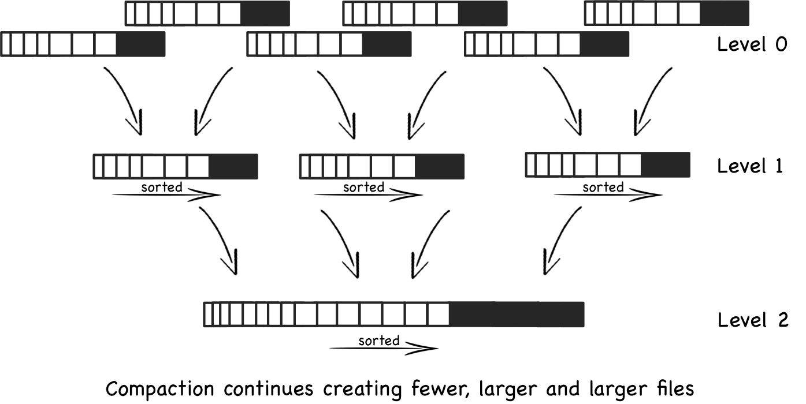

# Designing Data Intensive Applications

1. ## Chapter 1: Reliable, Scalable, and Maintainable Applications
    1. Fault vs Failure:
        - Fault: One component deviating from its spec
        - Failure: Whole system stops providing service
        - Aim: Stop Fault → Failure
        - Good way to test:
            - Introduce fault and see if it causes failure
            - example: chaos monkey
        - Faults and How to fix?
            - Hardware Faults:
                - Disk crashes, Memory corruption
                - RAID, Dual power supply
            - Software:
                - Bugs, Systematic Errors
                - Harder to isolate, require thorough testing, rethinking assumptions
            - Human Errors:
                - Configuration error leading cause
                - Create simple abstracted admin interfaces
                - Sandbox to test all scenarios on lower env
                - Provide easy rollback options
    2. Scalability
        - Ability to cope with increased load
        - Loads is expressed in:
            - Requests/sec for servers
            - Read/Writes /sec for DB
            - No. of simultaneous active users
            - In twitters case, Fan out i.e. poster to follower fan out 1:Million
        - Describing Performance:
            - Throughput: i.e. rate at which data processed
            - For server response times
        - Approaches to cope with load:
            - Scale up: Vertical Scaling: Upgrade to a more powerful machine
            - Scale Out: Horizontal Scaling: Add more machines to distribute
        - ℹ️Note: Latency vs Response Time:
            - Latency = delay inherent in system, the waiting time it took to travel from source to destination (and
              back in transit)
                - Metric for infrastructure
            - Response Time = Total time it took, includes Latency + processing time
                - Metric for user experience
    3. Maintainability
        - Make systems easier for people to work upon in future
        - Three Principles:
            1. Operability:
                - Make it easy for operations to keep system running
                - Monitoring, documentation, automation
            2. Simplicity:
                - Keep it simple for new engineers to continue work upon
                - Through abstractions
            3. Evolvability:
                - Also called extensibility
    4. Conclusion:
        - No size fits all solution
        - Each solution is a trade-off

2. ## Chapter 2: Data Models and Query Languages
    1. Relational vs Document Model
        1. Relational (SQL):
            - Structure: Tables (relations), each table is unordered collection of rows
            - Best for: Many-to-one and many-to-many relationships
            - Strict schema and normalization to reduce redundancy
            - Schema on write
        2. Document Model (NoSQL)
            - Structure: Data stored in self-contained documents (JSON/XML)
            - Best for: One-to-many relationships where data usually accessed together
            - Flexible schema
            - For schema on read (dynamic type checking)
        3. Convergence (i.e. supporting each other)
            - RelationalDB added Json/XML support
            - Document DBs added better querying capabilities, joins and schema options
            - Hybrid options quite common
        4. Impedance Mismatch
            - The difference between OOP representation and the way we store it
            - Relational Approach: Dividing classes into multiple tables (normalization)
            - Document Approach: Storing data as it exists on OOP, in one class
        5. Use in Many-to-One and Many-to-Many Relationships
            - Relational: Handle these very well via joins and foreign keys
            - Document: Struggle with this, require often joining data in application data, slow and complex
        6. Declarative vs Imperative Query Languages
            - SQL (Declarative):
                - Tell the DB what you want, let it decide the best path to find it
            - IMS/CODASYL (Imperative):
                - Provide the path as well
                - Brittle as paths break on db structure changes
    2. Graph Like Data Models:
        - Useful when many-to-many relationships dominate
        - Components: Vertices (nodes) and Edges (relationships)
        - Use cases: Social graphs, semantic web
        - Querying: Language like Cypher (Neo4j)
        - Example:
            - Creating relationships:
                - ```
                  CREATE (alice:Person {name: 'Alice', age: 30})
                  CREATE (bob:Person {name: 'Bob', age: 32})
                  CREATE (alice)-[:FRIEND]->(bob)
                  ```
            - Pattern Matching:
                - ```
              MATCH (p:Person {name: 'Alice'})-[:FRIEND]->(friend)
              RETURN friend.name
                 ```

3. ### Storage And Retrieval
    1. Log Structured Storage (LSM Trees)
        - Treat Databases as append only log, new data simply added at end of file
        - SSTables (Sorted String Tables):
            - Instead of random appending, append to each key
        - LSM-Trees (Log Structured Merge Trees):
            - 
            - Not an actual tree, more like large array where parts are sorted by compaction in tree like manner
            - High throughput in memory structure, dump to SSTables
        - Compaction:
            - Discards old values for the key only keeping new one

    2. Page Oriented Storage:
        - Traditional approach used by most RDBs
        - B Trees break DB into fixed size pages (usually 4/8KB)
        - Note: B Tree is a self-ba82/klancing tree data structure to efficiently store and retrieve large amounts of data,
          usually
        - In place updates: B Trees overwrite old data with new in place (unlike compaction which occurs routinely)
    3. Transaction Logs & Crash Recovery:
       - Since these structures overwrite data in place crashes can corrupt DB
       - **Write Ahead Log (WAL):** Write every single transaction to an append only file before updating B tree
       - Note: Since WAL stores all transactions it grows huge, and recovering state could take days replaying logs.
         - Checkpointing: Store WAL log timestamp/linenumber and db state
         - Modern implementations split WAL into segments (e.g. 64MB) and delete old segments after checkpointing is finish
    4. Other Indexing Strategies:
       1. Secondary Indexes: For searching using non-primary key
       2. Multi Column Indexes: For filtering by multiple fields simultaneously
       3. Full text Search: Allow searching for keywords within long strings of text
          - How it works:
            - Even before searching system processes the text, tokenizes, normalizes, stopword removed and lemmatize/stem.
            - Builds inverted index of the words i.e Word | Documents containing it
            - On search system uses your words and matches against inverted index using intersection
       4. In memory DB: Keep entire dataset in RAM to avoid disk I/O Bottlenecks
    5. OLTP vs OLAP
       - Online Transaction Processing vs Online Analytical Processing
       - OLTP: Handles day-to-day transactions
         - Small number of records per query (by key)
         - Users: End users (customers, clerks)
         - Queries Simple, fast (INSERT, UPDATE}, DELETE)
         - Very Fast Real time execution
       - OLAP: Handle analytical data
         - Large volumes of past data
         - Users: Managers and analysts
         - Queries: Are complex and heavy and time-consuming
         - Slower but optimized for analysis, don't need to be instant
   6. Row vs Column Oriented Storage
      - Rows:
        - Al columns for a single row are stored together contiguously
        - Best For OLTP
        - Faster for Transactions like INSERT, SELECT, DELETE
        - 🟢Fast Single Record Look up, simple storage model
        - 🔴Inefficient for analytics that scan only a few columns
        - e.g. mySQL, PostgreSQL
      - Columns:
        - Each column is stored separately contiguously
        - Reads only required columns thus speeds up when only few columns are needed
        - Much faster for aggregations
        - Row alignment is maintained by position
        - e.g. Amazon Redshift, Snowflake