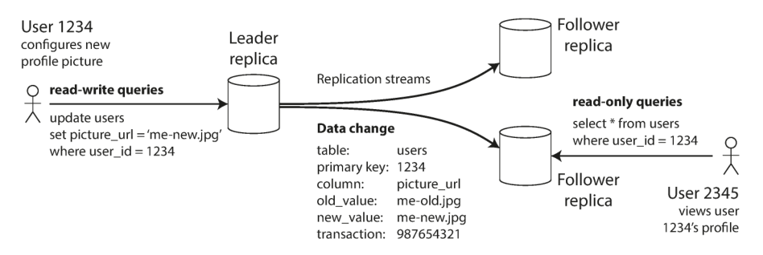
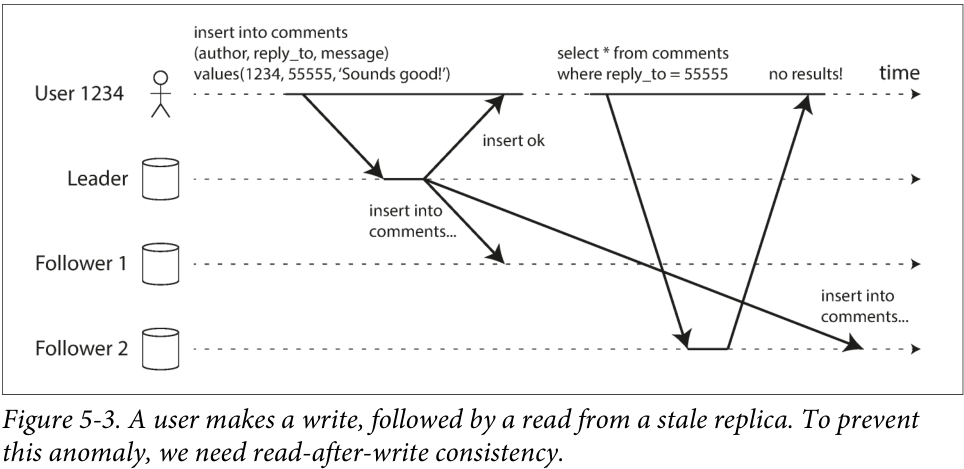
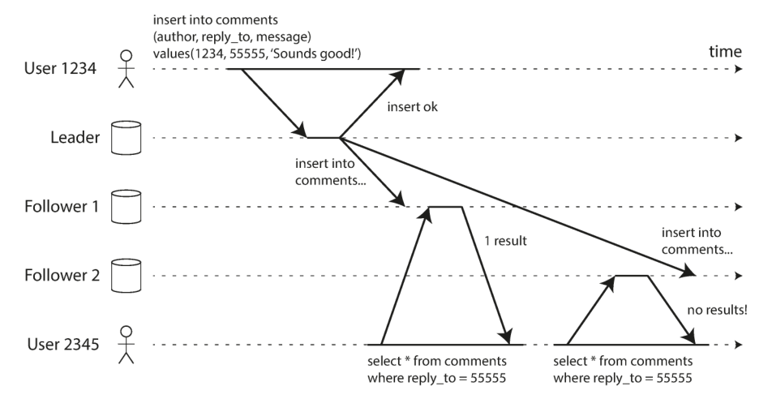
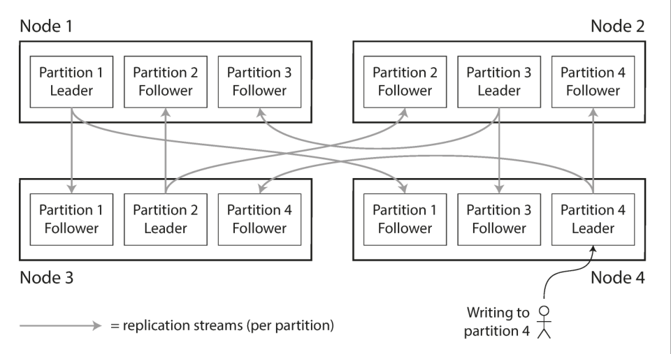
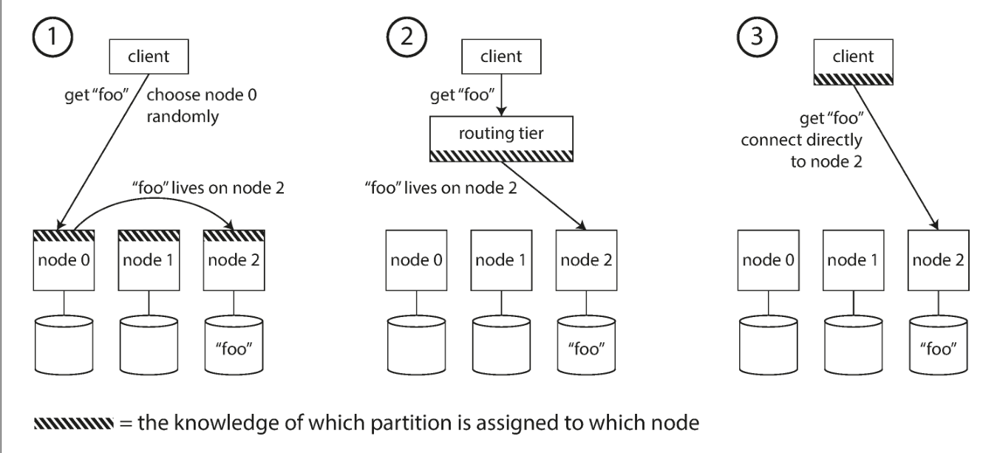
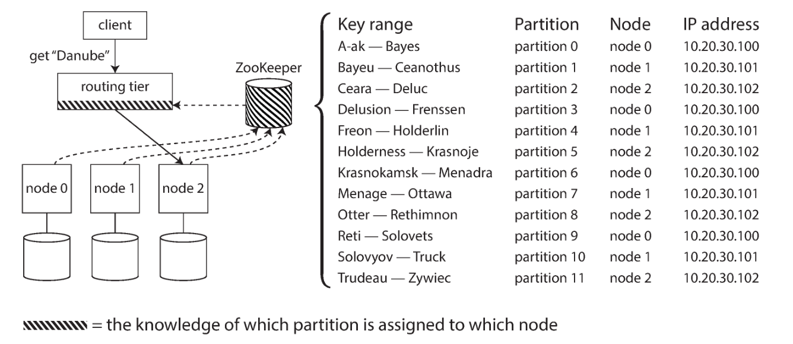

Scaling Up (vertical)- Shared Memory - Cost grows 2x compute/memory, low fault tolerance
Scaling out (horizontal)- Share nothing - can distribute as you want

Replication -> redundancy on other nodes
Partitioning -> Dividing data across nodes (sharding)

.5. Replication
reduce latency by geography
availibitliy
throughput

Copy -> Replica
Leader based -> Master slave
one leader writes, slave reads

Sync or Async replication?
Sync -> Guarantees replication even if leader fails
We don't sync all followers because of massive slowdown
In reality only one follower sync, others async (often called semi synchronous)
Async -> if leader fails it loses data, can continue processing even when followers are behind

Process of adding new follower:

- take snapshot of current leader
- Copy onto follower
- Get changelog of changes since creation of snapshot
- replay those changes

Failover:

- Follower:
    - just ask leader what has happened since
- leader:
    - usually marked as failed using a timeout
    - New leader: elected: usually most up-to-date node
    - Route requests to new leader
    - Old leader when it comes back up becomes follower
    - Note: if two nodes both think they are leader, called split brain. Dangerous since both go out of sync, some
      systems have auto shutdown in this case

Replication Methods:

- Statement based:
    - Copy each statement to followers like INSERT etc
    - Failure: Anytime non deterministic operation is performed like rand()/now()
- Write Ahead Log (WAL)
    - Append only sequence of the physical effect of query
    - Logs whatever was written, copies it to followers
    - Done using bytelevel WAL, so not storage engine agnostic (problem in migration)
- Logical Log:
    - Append only sequence but contains logical effect (i.e. engine agnostic)
    - For:
        - insert: New values of all columns
        - delete: info to identify row to delte
        - update: similar to insert
- Trigger based:
    - user defined application code to replicate

Reading after write consistency or Reading Own Writes
\

- Solved by:
    - Read from the same node you write on i.e. sticky nodes
    - Read only from leader if recent modification is true
    - Remember a timestamp on client and only serve from nodes which are more recent than that timestamp
    - Locally cache result on device and show output until the infra loads up
- Cross Device Read-after-write consistency:
    - Breaks:
        - Reading from same node
        - Timestamp logic
        - Local caching

Monotonic Reads:

- If user makes reads from multiple replicas depending on replication lag and order user can appear to go back in time
- Thus need a guarantee reads happen in the same right order i.e. **monotonically**
- 
- Solution:
    - Sticky Replica: i.e. user makes reads from same replica always
    - Timestamp based: Refuse to read from older or do not replace newer data when encountering older data

Consistent Prefix Reads:

- If user reads using independent readers on dbs cause and effect can appear in incorrect order
- We need a guarantee that reads happen in same order of writes
- 
- Solution:
    - Entries which have a causal dependency should be written to same node
    - Use complex algorithms which track this before that

Transactions:

- Logical unit of work that bundles multiple read/writes together
- Follows ACID to ensure:
    - Atomicity: all or nothing
    - Isolation: Other users cannot see changes until whole transaction completes
- Good way to ensure replication lag doesn't cause inconsistent states but becomes extremely expensive and unfit for
  many distributed systems

Multi Leader Replication:

- Instead of bottleneck at one leader use multiple
- Usually only fit for multi DC approach with each DC having its own leader
- Can have conflicts since no longer one leader ensuring it
    - Simplest solution:
        - Route users editing same data to same DC
    - Conflict resolution solutions:
        - Last Write Wins:
            - Highest timestamp write wins
            - Highly prone to data loss
        - Record conflicts and use application logic to resolve
        - Merging and concatenation of the two

Leaderless:

- No leaders, replicas accept writes directly from client
- Usually use a consensus mechanism for writes
- For reads since some nodes can be behind client sends read to multiple replicas
- Most upto date node based on timestamp is read
- Read Repair:
    - When client reads from multiple nodes it sees which nodes have stale values and writes back to them
    - Works well for frequently read values
- Anti Entropy Process:
    - Background process which checks for desyncs and syncs in no particular order
    - Needed for values which are rarely read to be synced
- The quorums (i.e. the consensus) is determined by params n,w,r (w + r > n) being the condition
    - Variables:
        - w:
            - Write quorum: Minimum number of nodes that must acknowledge a write operation
        - r:
            - Read quorum: Minimum number of nodes that must respond to a read operation
        - n:
            - Replication Factor: Total number of nodes in system that have copy of same data
    - Golden Rule:
        - Strict Quorum: If W+R > N then system has overlap and is thus consistent
    - Some dbs allow configuring this

Monitoring Staleness:

- Can be done by using a time based id for each write and subtracting how far behind each replica is
- Problem?
    - Writes are no longer linear in

Partitioning/Sharding:

- Each piece of data belongs to exactly one partition

With Replication:

- Often done in order to have high availablity and reliablity
- Node can be leader of one partition and follower of another
- 

Skew:

- Ideally data is evenly distributed
- In reality data could be heavily skewed towards one partition or several
- partition with disproportionately high load is called a hot spot
- Reason?
    - For ideal distribution we distribute randomly, this has downside of not knowing where each data should go
    - Using a key assignment model we can deterministicly route to same node
    - If too many keys route to same we get skew

Partitioning Methods:

- By Key Range:
    - Assign a continuous range of keys to each partition
    - 🔴Even if keyspace is evenly distributed data might not be (for e.g. more name begins with certain letters of
      alphabet)
    - 🔴Hotspots can occur temporarily which block concurrency for e.g. if key is date then all writes will go to same
      node each day
    - 🟢Can perform keyrange queries since data is on same node
- Hash of Key:
    - 🟢Randomizes better than key range by taking a key and distributing it randomly
    - It is random but deterministic
    - Can use cryptographically weak algo as long as distribution is random
    - 🔴Loses benefit of key range i.e. aggregating and range operations since data is not on same node
- Note: All of these are primary key based partitioning since they map record to data. Secondary key partitioning is far
  more complex since no longer 1:1. Avoid if possible
- Secondary Key Based:
    - Index based:
        - Instead of searching through entire DB we maintain an index on each node (called local index) or using a
          larger index which links to entry on each node (global index/term partitioning)
            - Local Index: Index stores refs to only its own data
            - Term Partition: Seperate Entity Index which can refer other data, thus being independent in storage
        - 🔴If we add a new secondary key later DB has to parse all historical data and find entries to insert into
          index (called backfilling)
        - 🟢Reads are cheap
        - 🔴Writes become expensive
        - Approach to gather all keys based on index in partitioned DB is called Scatter Gather
- Dynamic Partitioning:
    - Partition based on dynamic requirements for e.g. if data on nodes becomes too large, split
    - Advantage of using less resources if not required
    - Rebalancing can be costly depending on partitioning size

Rebalancing Nodes:

- Machines can go down or more machines can be needed for parallelizing
- Keyspace thus needs to be rebalanced between new nodes
- Strategies:
    - hash mod N
        - 🔴Never do this
        - %N will split between N easiley but whenever there is a single change in nodes a lot of keys will need moving
          since hash mod N will change for all
    - Fixed Number of partitions:
        - Create far more partitions than nodes giving more than 1 to each
        - Whenever there's a new node give it some from node with most
        - Whenever there's a node going down hand it to one with least
- Automatic vs Manual:
  - Automatic Rebalancing can be convenient tool to rebalance data without needing admin supervision
    - 🔴 Can Massively slow down the network if done without just cause
  - Manual: 
    - 🟢 Often better when done with right intentions and checks on human part

- Choosing Size of Partitions:
    - If partitions are very large, require large amount of time and data transfer to rebalance
    - If too small then much more overhead tracking data and partition metadata across all nodes
        - e.g. Election storm when new leader needs to be elected and we have too many small partitions

Routing to node:
- Can be done in multiple ways
  - Have a routing layer
  - Have node point to others
  - Store at client, choose using hash
  - 
- Zookeeper:
  - Common service which every node registers to.
  - Routing tier directly connects to this to get routing info
  - 
- Gossip Protocol:
  - Nodes gossip between each other
  - Request can be sent to any node which routes to appropriate Node
  - Removes external service dependency

# Transactions
- In DBs operations can fail for any number of reasons both S/w and H/w reasons
- Transactions group together several reads and writes together in a logical unit which is executed together
- Implement ACID Properties
- Come at a cost of performance and availability
- Note: ACID compliance is a murky topic since implementations of ACIDs differ

ACID:
- Atomicity:
  - Smallest unit i.e. must occur fully or not at all (no partial running)
  - If some of the writes in a transaction fail even the successful ones are rolled back
  - With this retrying doesn't do the operation twice
- Consistency:
  - Actually a property of application
  - To verify that the operations don't violate the constraints of the system (i.e. balance should add up to credit - debit in accounting)
  - Doesn't actually belong in ACID
- Isolation:
  - Concurrent execution is isolated from each other
  - Ideally each transaction should occur as if they occur one by one
  - Gold standard is Serializable isolation where operations have to wait in line (but terrible for performance so hardly ever used)
- Durability:
  - Transactions data is not lost i.e. it is written to non-volatile storage
  - In some modern db it also means that it has been replicated
- Note: NoSQL Dbs don't have these guarantees in place, even operations like multi-put are often not atomic and may fail partially

Aborts:
- Handled usually by retrying
- Not a perfect system in cases:
  - Transaction succeeded on server but acknowledgement to client failed
  - If system is overloaded retrying will just load it load
  - Pointless in cases like constraint violation
  - Where each transaction also has side effects like email sent

Isolation:
- Most DBs act as if each transaction is serial but not actually true
- Just using ACID is not enough
- Levels:
  - Read Committed:
    - Most basic
    - Guarantees:
      - Only reads data that has already been committed (no dirty reads)
      - Only overwrites data that has already been committed (no dirty writes)
    - Dirty Read: TTrn