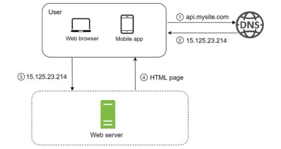
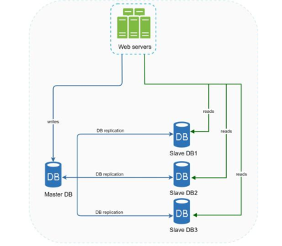
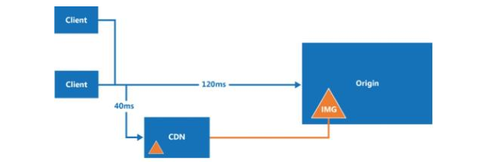
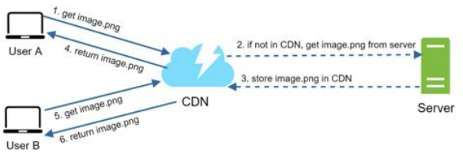
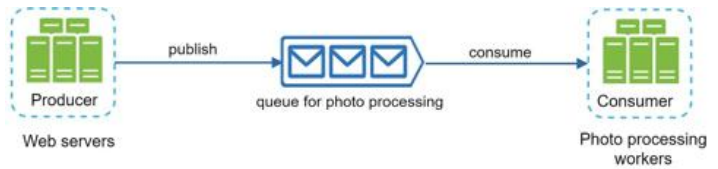
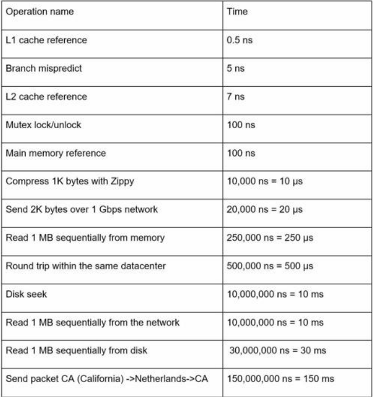

# System Design Interview

## Chapter 1: Scale from zero to millions of users

1. ## Single Server Setup:
    - Everything runs on single server
    - Extremely basic
    - ### User flow:
        - Client queries DNS, gets IP of website
        - Uses IP to connect to website using HTTP
        - Server returns HTML page or JSON response
    - 
2. ## Single Server With DB:
    - self-explanatory
    - Can use RDB or NoSQL DB
3. ## Vertical vs Horizontal scaling:
    - ### Vertical or Scale Up:
        - Upgrade to more powerful machines with more compute/RAM
        - Has diminishing returns in terms of how far you can scale up
        - Comes with the benefit of not rewriting and not needing to parallel your code
    - ### Horizontal Scaling or Scale Out:
        - Add more machines to execute in parallel
        - Requires your code to be executed parallel
        - Requires load balancing too
4. ## Load Balancer:
    - Evenly distributes incoming traffic among webservers
    - Act as middle man proxies (not like dns servers which tell where to go)
    - For security load balancers use private IPs to communicate with servers
      - 
    - ### Process:
        - Request Arrives
        - Health checks servers
        - Based on algo chooses best one
        - Forwards to said server
        - Once response received sends back to client
    - ### Common Routing Algorithms:
        - Round Robin
        - Least Connections; i.e. Server with the least active sessions
        - IP Hash: To reliably route to same
        - Least Response Time
5. ## Demilitarized Zone (DMZ) and Virtual Private Cloud (VPC):
    - ### DMZ:
        - Subnetwork that contains and exposes org's services that are to be exposed to the internet
        - Acts as a buffer zone, this way you don't need to expose your VPC
        - Protects internal networks
        - Usually put inside DMZ with gateway exposing it, one more firewall exists behind it to isolate from main VPC
        - DMZ is a security pattern
    - ### VPC:
        - Private isolated section of a public cloud e.g. AWS, GCP
        - Locked off from public and provides:
            - Isolation
            - Control: Over ip ranges, subnets and routing tables
        - VPC is an infrastructure construct
    - ### IGW
        - //todo
6. ## Database Replication:
    - 
    - Usually done with a master slave relationship
    - Write operations are only supported by Master node
    - Slave get copies of master DB and only supports read (when enabled)
    - Most applications are read heavy so having limited master works
    - //todo expand
7. ## Cache
    - Temporary storage area stores result of expensive queries/operations
    - Mitigates repeated calls to db
    - ### Read through Cache:
        - Web server first checks if cache has result of a query
        - If not queries db, stores response in cache and sends to user
    - ### Considerations:
        - When to use:
            - Data that is read frequently but modified rarely
            - Should not be used for data that is persisted i.e. cache is volatile
        - Expiration Policy:
            - Should be implemented to prevent data from existing in memory permanently
            - Should be long enough that it saves db calls
            - But short enough that it doesn't in memory for long times
        - Consistency:
            - Keeping data in store and cache in sync
            - Inconsistency: If data modifying transaction for cache and store is separate
        - Eviction Policy:
            - Once cache is full, decide which policy to use to remove items to make space for new
                - Common policies:
                    - LRU (Least Recently Used)
                    - LFU (Least Frequently Used)
                    - FIFO (First in first out)

8. ## CDN (Content Delivery Networks)
    - 
    - 
    - Geographically dispersed servers used to deliver static content
    - Cache static content like images videos css js
    - Dynamic Caching
    - Process:
        - On first try the file doesn't exist on cdn, request goees to CDN but cdn requests Server
        - Fetches from origin server first time then caches based on header
        - On second try by user request
    - ### Configuration:
        - Controlled using cache-control headers
        - `Cache-Control`:
            - `max-age`: This one is for browsers to cache file for how many seconds
            - `s-maxage`: (s:shared) tells CDN to keep file for max X seconds
            - `public` vs `private`: Private i.e. only for user's browser, public for all
            - `no-cache`: don't cache it
        - ETag Validation: If file hasn't changed on server just compare hash before discarding from CDN
    - ### Considerations:
        - Run by 3rd Party: Charged for data transfer in and out of CDN, do not cache infrequent use items
        - Set appropriate cache expiry to reduce refetching, but still be fresh
        - Fallback: CDNs can fail, clients should have ability to connect to origin if they do

9. ## Stateful and Stateless Architecture:
    - ### Stateless Architecture:
        - Server does not retain any info about client's previous interaction
        - Each request from client must contain all info for server to perform the operation
        - Characteristics:
            - Each request isolated
            - Scalability: Highly scalable horizontally due to no requirement of same server
            - Authentication: Done using JWTs
            - Fault Tolerant: Can reroute quickly on failure
    - ### Stateful Architecture:
        - Server actively stores info about client's session and previous interactions
        - Data maintained on the server's memory (JVM Heap in spring boot)
        - Characteristics;
            - Context Retention: Server retains context, user only needs to send in next operation
            - Session Management: Relies on session IDs
            - Scaling: Hard to impossible to scale horizontally (requires sticky session)
    - Note: Session Externalization is a stateful hack that converts stateful apps to stateless while maintaining same
      arch

10. ## Data Centers:
    - DC
11. ## Message Queue:
    - 
    - Form of asynchronous service to service communication
    - Decouple the Producer and Consumer
    - Point to Point Communication: Allow for communication between one to another async
        - Allow round-robin/least loaded algos to distribute
        - Acknowledgements (ACKs): Ensure atleast once delivery, consumer sends ACK to publisher or else message is
          requeued
        - Persistence: Messages are often stored on disk to ensure they aren't lost if a service crashes before
          processing them.
    - Examples: RabbitMQ, IBMMq
    - ### Message Brokers:
        - More complex orchestration pattern
        - Supports broadcasting i.e. more than point to point:
            - Can have publisher subscriber where one publishes to multiple
            - Can have brokers use routing logic to send to specific consumer based on some logic
        - Can translate data between different messaging protocols
    - ### Dead Letter Queues:
        - In case of message failing to be consumed i.e. no ACK being received on multiple attempts can become poison
          message
        - Eats up resources over and over again and blocks others
        - Routed to Dead Letter Queue based on:
            - Exceeding `MaxDeliveryAttemps`
            - Queue length limit: Exceeds the max number of messages in queue
            - Schema mismatch
    - ### Modern vs Legacy:
        - Legacy:
            - Simple Point to point communication
            - IBM MQ, RabbitMQ
            - Publish, Consume model, with destructive consumption on ACK
            - Logic is centred on broker
        - Modern Alternative: Message Streams

12. ## Message Streams:
    - Modern systems such as Kafka, Redpanda
    - Use immutable append only logs
    - Message written to end of log and immutable, not deleted upon consumption
    - Consumer Maintains state: i.e. Consumer contains it's own offset deciding where to read from
    - Stores much longer periods of data allowing re-playability
    - Pull based model (Backpressure): Consumers pull data when they have resources thus preventing consumer crashes
    - Scalability: Much more horizontally scalable by partitioning messages
13. Logging Metrics and Automation
14. ## Database Scaling:
    - ### Vertical Scaling:
        - Increasing the capacity of single machine to meet demands
        - In DBs, quite simple since single endpoint but we hit hardware wall eventually
    - ### Horizontal Scaling:
        - Involves adding more nodes and distributing load
        - Done through:
            - Sharding: Breaking DB into smaller chunks and distributing
            - Read Replicas: Use primary node for write and multiple secondary for read
        - Considerations:
            - Sharding:
                - Sharding Key:
                    - Key allows you to route to the same node consistently
                    - If too many entries on same key (using {} hash) causes hot slot
                      problem [see](../../Notes/Software/Redis.md#hot-slot)
                - Join and Denormalization:
                    - Once data has been sharded joins become harder to perform since data is no longer on same node
                    - Possible solution is to denormalize data to begin with

# Chapter 2: Back of envelope estimations

- Basics:
    - Interviews can ask to estimate metrics of system design
    - Important to have an idea of the back of the envelope estimation
    - Latency numbers for reference (note could be outdated)
        - 
    - Metrics:
        - Latency
        - Availability:
            - Ability of system to be continuously operational for a long period of time
            - Measured as %, 100% means 0 downtime, most common 99%-100%
            - If drops below threshold can breach SLA (Service Level Agreement)
    - todo: add back of envelope twitter example

# Chapter 3: Framework for System Design Interviews

- Aim: To test technical skills as well as collaborative ones
- Format: Simulate design process where two coworkers collaborate to build design for a common product
- Process:
    1. Step 1: Understand Problem, establish design scope
        - Take your time to understand the problem than jumping straight in
        - Start with questions to refine and form proper assumptions
        - Ask questions poignant to the product:
            - Examples:
                - How many users does the product serve?
                - How fast does company intend to scale up? By what factor?
                - What is existing technology stack?
                - Is this for mobile or web or both?
    2. Step 2: Propose high Level Design and get a buy in
        - Develop HLD and reach agreement with interviewer
        - Good idea to collaborate with interviewer at this point
        - Come up with blueprint, ask for feedback and treat as teammate and not adversary
        - Draw boxes and diagram on white board or paper if provided
        - Back of envelope calcs along with blueprint
        - Go through actual use cases too
    3. Step 3: Design Deep Dive
        - At this stage you should have agreement on goals and scope
        - Sketched hld and gained feedback
        - Flesh out details, depends mainly on interviewer which aspect they care about like latency, resiliency etc
    4. Step 4: Wrap Up
        - Mostly a retrospective on design
        - Never say design is perfect but identify bottlenecks and alternatives
        - Give recap of full system to sum it up
        - Mention issues and how to monitor them

    - Time Allocation:
        1. Step 1: 3-10 mins
        2. Step 2: 10-15 mins
        3. Step 3: 10-25 mins
        4. Step 4: 3-5 mins

- 