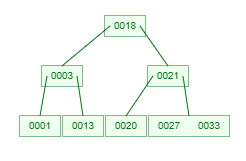
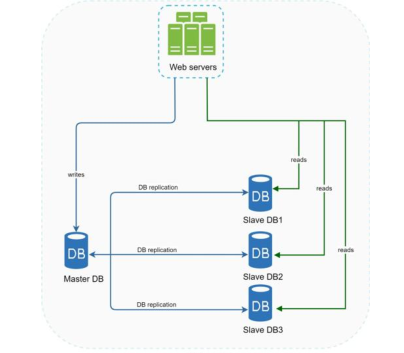

# Basics

### 1. Database vs Datastore

- Data Store: A broad, generic term for any repository where data is kept persistently. It is an umbrella category that
  includes files, folders, hard drives, and cloud storage, as well as databases.
- Database: A specific, highly structured type of data store that includes a Database Management System (DBMS). It
  provides advanced capabilities for querying, data integrity, security, and transaction management.

### 2. OLAP vs OLTP Database

OLTP (Online Transaction Processing) is optimized for executing operational tasks
OLAP (Online Analytical Processing) is optimized for complex data analysis and querying large volumes of historical data

| Feature        | OLTP (Transaction)                                          | OLAP (Analysis)                                                    |
|----------------|-------------------------------------------------------------|--------------------------------------------------------------------|
| Primary Focus  | Day-to-day operations, fast transaction processing.         | Data analysis, business intelligence, data mining.                 |
| Data Structure | Normalized (3NF) to reduce redundancy and ensure integrity. | Denormalized (Star/Snowflake schema) for fast querying.            |
| Query Type     | Short, simple inserts, updates, and deletes (CRUD).         | Complex queries involving heavy aggregations (SUM, AVG, GROUP BY). |
| Response Time  | Milliseconds.                                               | Seconds to hours (depending on data volume).                       |
| Data Volume    | Gigabytes to Terabytes (frequently archived).               | Terabytes to Petabytes (historical data).                          |
| Storage Style  | Typically row-oriented.                                     | Typically column-oriented.                                         |

### 3. Types of DataBases

- Broadly Two Types:
    - Relational Databases (RDBMS)
    - NoSQL Databases
- Note: OLTP includes more than just transactions, likes on an instagram post which go for eventual consistency and BASE
  are also OLTP
- Third Type: OLAP DBs (not included in the two since the first two are used for OLTP)

### 4. Relational Databases

* Data Model: Rows and columns in structured tables. Uses strict schemas.
* Properties: High ACID (Atomicity, Consistency, Isolation, Durability) compliance.
* Scaling: Primarily vertical (buying a bigger machine).
    * Horizontal scaling via sharding or replication is complex.
        * Why? Hard to commit to ACID
        * locking rows or tables to ensure a transaction succeeds completely or fails completely is straightforward on
          Single machine
        * For multiple machines need to use 2 Phase commit which adds significant latency
* For Financial systems, order management, or any application where data integrity and complex joins are non-negotiable.
* Historically RDB are the goto solution due to being a good default support
* Reasons for using NoSQL DBs:
    * Your application requires super-low latency.
    * Your data are unstructured, or you do not have any relational data.
    * You only need to serialize and deserialize data (JSON, XML, YAML,
      etc.).
    * You need to store a massive amount of data.

### 5. NoSQL Databases

Include all non RDB

- Key-Value Stores:
    - Concept: Highly performant hash tables.
    - Examples: Redis, Memcached.
    - Best Use Case: Caching, session management, leaderboards.
- Document Databases:
    - Concept: Stores data as JSON, BSON, or XML documents.
    - Examples: MongoDB, DynamoDB.
    - Best Use Case: Product catalogs, user profiles, content management.
- Wide-Column Stores:
    - Concept: Stores data in column families instead of rows
        - Essentially:
            - $$\text{Map}<\text{RowKey}, \text{Map}<\text{ColumnName}, \text{Value}>>$$
            - Where each row can have different columns unlike RDB
            - Rows can be infinitely wide and sparse, the database cannot store a row as a contiguous block of data on
              disk.
            - Instead, every single column value (or "cell") is treated as an independent key-value pair.
    - Highly optimized for massive write throughput and distributed setups.
    - Examples: Cassandra, ScyllaDB.
    - Best Use Case: IoT telemetry, time-series logging, high-volume analytics.
    - popularized by Google's Bigtable paper
    - Reason for high throughput?
        - Use of LSM Trees and lazy insertion using a WAL
        - In cases of conflicts, happen at read (since LSM Trees do not have single key consistency) last write wins
- Graph Databases:
    - Concept: Uses nodes (entities) and edges (relationships) to represent data.
    - Examples: Neo4j, Amazon Neptune.
    - Best Use Case: Social networks, fraud detection networks, recommendation engines.

### 6. DB Indexing Schemes

| Index Type                                | Underlying Structure             | Primary Use Case                       | Key Characteristic                                                                                       |
|-------------------------------------------|----------------------------------|----------------------------------------|----------------------------------------------------------------------------------------------------------|
| **B-Trees / B+ Trees**                    | Self-balancing search trees      | RDBMS read optimization                | Optimized for disk I/O and range queries; keeps data sorted.                                             |
| **LSM Trees** (Log-Structured Merge-tree) | MemTable (RAM) + SSTables (Disk) | Write-heavy NoSQL (Cassandra, RocksDB) | Appends writes to memory first, making writes extremely fast; background compaction resolves duplicates. |
| **Inverted Index**                        | Map of words to document IDs     | Search engines (Elasticsearch)         | Enables full-text search capability.                                                                     |

1. BTrees:
    - 
    - Self-balancing search trees, each node can have multiple children
    - Guarantees $O(\log n)$ time complexity for search, insertion, and deletion
2. B+ Tree:
    - 
    - A variation of the B-Tree. Internal nodes only store keys (for routing)
    - Data pointers are stored in the leaf nodes
    - Leaf nodes are linked together in a sequential chain.
    - Most relational database management systems (RDBMS) like MySQL (InnoDB) and PostgreSQL use this
    - Maximizes fan-out (more keys per node), reducing disk I/O.
        - How?
            - In standard b tree a node stores key,data and child nodes within a fixed size page (i.e. needs more i/o
              while navigating)
            - In B+ you only get data once you find right key, i.e. more keys fit inside same page size
3. Log-Structured Merge-Tree (LSM-Tree)
    - append data to a write-optimized structure rather than updating data in-place
    - How it works: Writes are first directed to a fast, in-memory buffer (MemTable) (this sorts it by key to enable
      working on same key first)
    - When full, the data is flushed to disk as an immutable Sorted String Table (SSTable).
    - Periodic background processes (compaction) merge these tables.
    - 🟢Pros: Eliminates random disk writes, maximizing write throughput.
    - 🔴Cons: Reads can be slower because multiple files on disk may need to be searched to find the latest version of a
      key
4. Bit-Mapped Indexing
    - indexing technique that uses arrays of bits (0s and 1s) to represent the presence or absence of a value in a row
    - For example marital status → 1 married 0 unmarried → [0 1 1 1 0]
    - Used often in OLAP or column based indexing
    - 🟢Blazing Fast Logical Queries: Ideal for complex ad-hoc queries combining multiple filtering criteria.
    - 🔴The High-Cardinality Trap: If a column has millions of unique values (like SSN, Email, or User_ID), you would
      have to create millions of bitmaps

### 7. Decision Matrix for System Design Interviews

Use this mental checklist when selecting a database during an interview:

1. **What is the Read/Write ratio?**
    * Heavy Writes $\rightarrow$ LSM-Tree based NoSQL (Cassandra) or append-only logs.
    * Heavy Reads $\rightarrow$ RDBMS with Read Replicas, or Key-Value caches (Redis) in front.

2. **Does the data require complex relationships/joins?**

    * Yes $\rightarrow$ RDBMS or Graph DB.
    * No $\rightarrow$ Document or Key-Value store.

3. **What are the consistency requirements?**

    * Strict ACID required $\rightarrow$ RDBMS.
    * Eventual consistency acceptable $\rightarrow$ NoSQL / AP systems.

4. **Data Volume & Growth?**

    * Fits on a single terabyte-scale machine $\rightarrow$ Stick to RDBMS.
    * Petabyte scale requiring horizontal scaling $\rightarrow$ NoSQL or natively distributed SQL (e.g., CockroachDB,
      Google
      Spanner).

### 7. Other DB Paradigms

- ### Multi-Model Databases
    - Most modern databases no longer limit themselves to a single category.
    - Redis: Originated as a key-value cache; now natively handles JSON documents, time-series data, graph
      relationships,
      and
      vector search.
    - MongoDB: Primarily a document store; now includes graph lookups, time-series collections, and vector
      embeddings.Relational Databases
    - (PostgreSQL/MySQL): PostgreSQL handles relational tables, structured JSON documents (
      JSONB), and vector data (pgvector)

- ### OLAP DBs

    - OLAP (Online Analytical Processing) systems require databases optimized for complex, large-scale aggregation
      queries
    - Use columnar storage since large scale Analytics only need a few columns of data at a time
    - Note: OLAP is often the most used storage solution for Logs:
        - Columnar Storage
        - Append Only: OLAP databases are optimized for this append-only behavior
        - High Compression Ratios: data is stored column-by-column, identical or similar data types sit next to each
          other on disk (e.g., repeating strings like INFO or ERROR). OLAP databases leverage this to achieve massive
          compression ratios (often 5x to 10x better than standard RDBMS)
        - Exactly how Splunk and the ELK Stack (specifically Elasticsearch) work under the hood

- ### Other Modern DBs in age of AI

| Database Category            | Core Focus                                                                                    | Prominent Examples                      |
|------------------------------|-----------------------------------------------------------------------------------------------|-----------------------------------------|
| **Vector Databases**         | Optimizing high-dimensional embeddings for GenAI and LLM semantic search.                     | Pinecone, Milvus, Qdrant                |
| **Time-Series Databases**    | Ingesting and querying massive streams of time-stamped IoT, metrics, and log data.            | InfluxDB, TimescaleDB                   |
| **NewSQL / Distributed SQL** | Combining the horizontal scalability of NoSQL with strict ACID compliance of traditional SQL. | CockroachDB, Google Spanner, YugabyteDB |
|                              | Instead of traditional expensive 2 phase, issue copies to each and use consensus mechanism    |                                         |

### 8. Transactions

- Sequence of one or more operations (such as reading or writing data) executed as a single, logical unit of work.
- Every transaction must adhere to the four [ACID](#9-acid) properties to ensure data consistency and validity.

  ## Core Operations
    - Transactions rely primarily on two control statements:
        * `COMMIT`: Saves all modifications made during the transaction permanently.
        * `ROLLBACK`: Undoes all modifications made during the transaction, restoring the database to the last committed
          state.

### 9. ACID:

- **Atomicity**:
    - Smallest unit i.e. must occur fully or not at all (no partial running)
    - If some of the writes in a transaction fail even the successful ones are rolled back
    - With this retrying doesn't do the operation twice
- **Consistency**:
    - Actually a property of application
    - To verify that the operations don't violate the constraints of the system (i.e. balance should add up to credit -
      debit in accounting)
    - Doesn't actually belong in ACID
- **Isolation**:
    - Concurrent execution is isolated from each other
    - Ideally each transaction should occur as if they occur one by one
    - Gold standard is Serializable isolation where operations have to wait in line (but terrible for performance so
      hardly ever used)
- **Durability**:
    - Transactions data is not lost i.e. it is written to non-volatile storage
    - In some modern db it also means that it has been replicated
- Note: NoSQL Dbs don't have these guarantees in place, even operations like multi-put are often not atomic and may fail
  partially

### 10. BASE:

Developed as an alternative to the traditional ACID which is often too restrictive for massive, distributed systems

1. Basically Available (BA)
    - The system guarantees that it will remain operational and available to respond to requests, even if parts of the
      network or hardware fail.
    - Instead of shutting down or refusing connections to protect data consistency, the
      database will return a response (even if that data is slightly stale).
2. Soft State (S)
    - The state of the data can change over time without explicit user interaction.
    - It takes time for updates to propagate everywhere.
3. Eventual Consistency (E)
    - The system will eventually become consistent once it stops receiving updates.

### 11. Idempotency

### 10. CAP Theorem

A distributed data store can simultaneously provide at most two out of the following three guarantees:

1. **Consistency**
    - Once a write operation is successfully completed on any node in the system, all subsequent read
      operations—regardless of which node they land on—must return that new value, or an even newer one.
    - i.e. All nodes will return same value for the data
2. **Availability**
    - Each read or write request for a data item will either be processed successfully or will receive a message that
      the operation cannot be completed.
    - If a node is alive and healthy, it must accept reads and writes.
    - It is not allowed to say, "I am disconnected from the rest of the cluster, so I cannot answer you."
3. **Partition Tolerance**
    - A network partition is a communication failure between nodes. Messages are dropped, delayed, or split entirely,
      dividing one cluster into isolated groups that cannot talk to each other.
    - The system must continue to operate as a whole, despite arbitrary message loss or delays between nodes.
      Because networks are inherently imperfect, a distributed system must be designed to survive partitions. i.e.
      Partitioning is an inherent unavoidable issue

You cannot choose "CA" (Consistency + Availability) because Partition Tolerance (P) is not a configuration setting; it
is a law of physics.

## The Two Choices During a Partition

1. Choose Consistency (Cancel Availability)
    - You decide that serving old, incorrect data is worse than serving no data at all.
    - What happens: If a node is cut off from the rest of the cluster, it refuses to accept writes or answer reads. It
      returns an error or times out.
    - Result: Your data remains perfectly correct across the system, but your application appears "down" or broken to
      some users.

2. Choose Availability (Cancel Consistency)
    - You decide that keeping the application up and running is more important than perfect data accuracy.
    - What happens: The isolated node continues to accept writes and answer reads using whatever stale data it has.
    - Result: Your application stays online for everyone, but different users will see different versions of the
      data. The data diverges, and you will have to manually or automatically resolve the conflicts later once the
      network heals.

## 12. Database Replication:

- 
- Usually done with a master slave relationship (often called Primary Replica or Leader Follower)
- Write operations are only supported by Master node
- Slave get copies of master DB and only supports read (when enabled)
- Most applications are read heavy so having limited master works
- 🟢Most applications are read heavy so higher availability from slave nodes
- 🟢More Reliable since loss of one db server doesn't mean loss of data

### Synchronous Replication

Transaction is not committed until it has been successfully propagated to all replicas. Returns success only to client
after that

- 🟢Guarantees all followers have up-to-date data
- 🔴Terrible for performance as leader has to wait for all nodes (the total transaction time = time for slowest node)
    - Often in reality we use semi synchronous i.e. change is propagated to at least one node
- 🔴If replica becomes unreachable entire write stalls or fails

### Asynchronous Replication

Primary node commits locally and returns a success immediately, then broadcasts update to replicas

- 🟢Makes writes extremely low latency, decoupling network lag from write acknowledgement
- 🔴Creates replication delay (also called data lag)
- 🔴If primary node fails changes can be lost

### Process of adding new replica:

- Take snapshot of current leader
- Copy onto follower
- Get changelog of changes since creation of snapshot
- replay those changes

### In case of Failover:

- **Replica Failover**:
    - Just ask leader what has happened since it's last timestamp
- **Leader Failover**:
    - Usually marked as failed using a timeout on heartbeat
    - New leader: elected: usually most up-to-date node
    - Route requests to new leader
    - Old leader when it comes back up becomes a follower (replica)
    - Note: if two nodes both think they are leader, called split brain.
        - Dangerous since both go out of sync, some systems have auto shutdown in this case

### Replication Methods:

- Statement based:
    - Copy each statement to followers like INSERT etc
    - Failure: Anytime non-deterministic operation is performed like rand()/now()
- Write Ahead Log (WAL)
    - Append only sequence of the physical effect of query
    - Logs whatever was written, copies it to followers
    - Done using byte level WAL, so not storage engine agnostic (problem in migration)
- Logical Log:
    - Append only sequence but contains logical effect (i.e. engine agnostic)
    - For:
        - insert: New values of all columns
        - delete: info to identify row to delte
        - update: similar to insert
- Trigger based:
    - user defined application code to replicate

### 11. Consistency

In distributed systems, data consistency models define the rules for how and when changes made to a data store are
visible to different users or nodes across a network.

### Quorum Consistency

Protocol used to guarantee data correctness across multiple server nodes without waiting for every single node to
respond  
Instead of requiring all nodes to agree on a read or write operation, a system defines a minimum number of successful
votes required to complete the operation:

- $N$: The total number of replicas (nodes storing copies of the data).
- $W$: The write quorum (the number of nodes that must acknowledge a write before it is considered successful).
- $R$: The read quorum (the number of nodes that must respond to a read request).

- Note: the client application itself does not manually contact $R$ individual servers.Instead, the system relies on a
  Coordinator Node.
    - Whichever node client hits turns into coordinator fetching from others itself
- Note: This can work across partition too where we only check partitions which are replica of same

1. **Strong Consistency (Linearizability)**
    - Guarantees that once a write operation completes, any subsequent read operation will return the value of that
      write, or a later one regardless of which node in the distributed system is queried.
    - **Monotonic Time and Order**: All systems read give same state in same order
    - Systems typically use strict quorum configurations, R+W>N, ensuring read and write always overlap
    - Coordination ensures data is made consistent sorted by timestamps
    - It prioritizes Consistency (C) over Availability (A) **CP System**
2. **Eventual Consistency**
    - A specific form of weak consistency
    - Guarantees that if no new updates are made to a given data item, all replicas will eventually converge and return
      the same last-updated value.
    - **Asynchronous Replication**: When a write occurs, the coordinator node updates its local state and immediately
      returns a success status to the client. The update is then propagated to other replicas asynchronously.
    - Sloppy Quorums ($R + W \le N$), A read might hit a replica that hasn't received the latest asynchronous update
      yet, resulting in stale reads.
    - Conflict Resolution: Need to use conflict mechanisms like Last Write Wins or CRDTs (Conflict-free Replicated Data
      Types)
    - Prioritizes Availability (A) and Partition Tolerance (P) (**AP system**) high scalability and low latency
    - Note: The difference between eventual and weak consistency is driven heavily by background reconciliation
      processes.
3. **Weak Consistency**
    - Provides the fewest guarantees.
    - Unlike eventual consistency, weak consistency does not inherently guarantee that replicas will eventually match
    - Used in Real-time data streams where speed is critical and losing individual packets or data points doesn't break
      the system e.g. video stream

**Raft and Paxos**
Are consensus algorithms designed to avoid problem of split brain  
Split Brain: If nodes become disconnected the two partitions can both end up electing a leader and accept updates
individually  
Prevent this by dictating that updates or leadership elections can only occur if a strict majority (a quorum) of the
total cluster nodes agree.

**CRDT (Conflict-Free Replicated Data Types)**
CRDTs are mathematically designed so that different operations can be applied in any order across different servers, and
they will always merge into the exact same correct state.

### 13. Consistency Problems

### Reading after write consistency or Reading Own Writes (should be able to read your own writes)

- Solved by:
    - Read from the same node you write on i.e. sticky nodes
    - Read only from leader if recent modification is true
    - Remember a timestamp on client and only serve from nodes which are more recent than that timestamp
    - Locally cache result on device and show output until the infra loads up
- Cross Device Read-after-write consistency:
    - Breaks:
        - Reading from same node
        - Timestamp logic
        - Local caching

### Monotonic Reads:

- If user makes reads from multiple replicas depending on replication lag and order user can appear to go back in time
- Thus need a guarantee reads happen in the same right order i.e. **monotonically**
- 
- Solution:
    - Sticky Replica: i.e. user makes reads from same replica always
    - Timestamp based: Refuse to read from older or do not replace newer data when encountering older data

### Consistent Prefix Reads:

- If user reads using independent readers on dbs cause and effect can appear in incorrect order
- We need a guarantee that reads happen in same order of writes
- 
- Solution:
    - Entries which have a causal dependency should be written to same node
    - Use complex algorithms which track this before that

### 14. Federation

- Integrates multiple DBs into one common interface
- To user entire system looks like one single DB
- Each DB maintains it's rules and autonomy, can be heterogeneous (sql + redis ) or homogeneous
- 🟢Allows organizations to connect old, disjointed systems without expensive and risky data migration projects.
- 🔴Performance Bottlenecks: Queries are only as fast as the slowest database
- 🔴Query Optimization: Creating an efficient execution plan for structurally different databases is difficult

### 15. Partitioning/Sharding:

- Horizontal data partitioning strategy, single DB is divided into multiple physical nodes called shareds
- Each node contains common schema but each piece of data belongs to exactly one partition
- Trade Offs:
    - 🟢Allows scaling DBs proportional to demand horizontally
    - 🟢Allows higher throughput, lower bottlenecks and higher availability
    - 🔴Cross-Shard Joins: Executing joins across different shards is highly inefficient, often needed to be done at app
    - 🔴ACID: Requires 2Phase Commit (very slow)
- **Shard Key**: The specific column or set of columns used to determine the placement of a given row.
- Partitioning Methods:
    - By Key Range:
        - Assign a continuous range of keys to each partition
        - 🔴Even if keyspace is evenly distributed data might not be (for e.g. more name begins with certain letters of
          alphabet)
        - 🔴Hotspots can occur temporarily which block concurrency for e.g. if key is date then all writes will go to
          same node each day
        - 🟢Can perform key range queries since data is on same node
    - Hash of Key:
        - 🟢Randomizes better than key range by taking a key and distributing it randomly
        - It is random but deterministic
        - Can use cryptographically weak algo as long as distribution is random
        - 🔴Loses benefit of key range i.e. aggregating and range operations since data is not on same node
- Dynamic Partitioning:
    - Partition based on dynamic requirements for e.g. if data on nodes becomes too large, split
    - Advantage of using less resources if not required
    - Rebalancing can be costly depending on partitioning size
- Rebalancing Nodes:
    - Machines can go down or more machines can be needed for parallelizing
    - Keyspace thus needs to be rebalanced between new nodes
    - Strategies:
        - hash mod N
            - 🔴Never do this
            - %N will split between N easily but whenever there is a single change in nodes a lot of keys will need
              moving
              since hash mod N will change for all
        - Fixed Number of partitions:
            - Create far more partitions than nodes giving more than 1 to each
            - Whenever there's a new node give it some from node with most
            - Whenever there's a node going down hand it to one with least
            - Used in Redis
    - Automatic vs Manual:
        - Automatic Rebalancing can be convenient tool to rebalance data without needing admin supervision
            - 🔴 Can Massively slow down the network if done without just cause
        - Manual:
            - 🟢 Often better when done with right intentions and checks on human part

### 14. Skew:

- Ideally data is evenly distributed
- In reality data could be heavily skewed towards one partition or several
- partition with disproportionately high load is called a hot spot
- Reason?
    - For ideal distribution we distribute randomly, this has downside of not knowing where each data should go
    - Using a key assignment model we can deterministicly route to same node
    - If too many keys route to same we get skew
