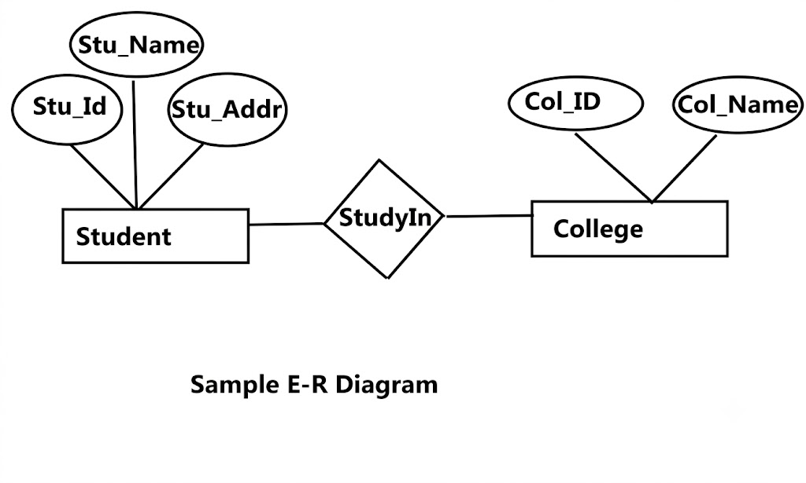
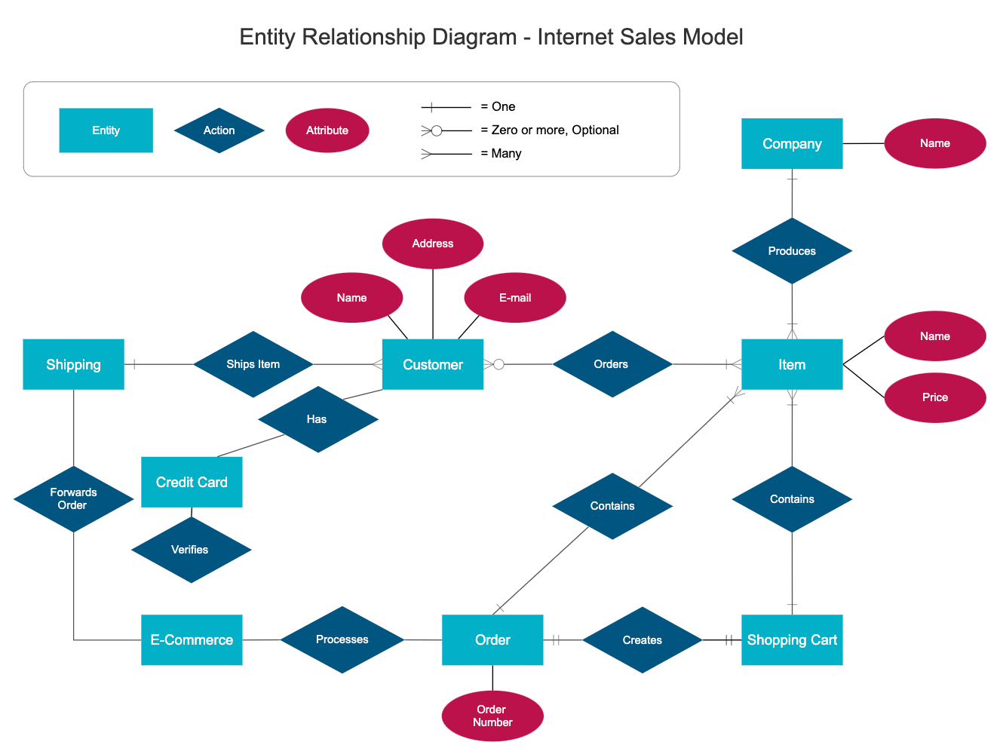
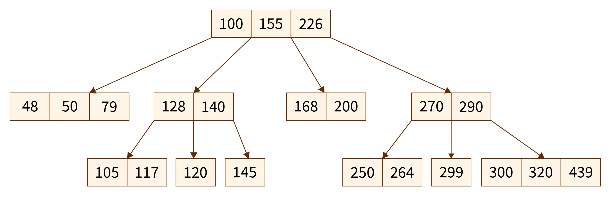
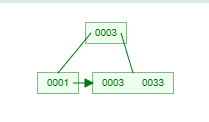

# DBMS Notes

---

## Module 1: Foundations of Data Storage

### 1.1 What Is a DBMS?

A DBMS (Database Management System) is software that stores, retrieves, and manages data efficiently, providing
concurrent access, security, and data integrity — as opposed to a plain file system, which lacks these guarantees.

| File System                     | DBMS                                        |
|---------------------------------|---------------------------------------------|
| Data redundancy is common       | Redundancy minimized via normalization      |
| No built-in concurrency control | Handles concurrent access safely            |
| No standard query mechanism     | SQL for querying                            |
| Manual backup/recovery          | Built-in crash recovery                     |
| No data integrity constraints   | Enforces constraints (PK, FK, unique, etc.) |

### 1.2 Database vs. Data Store

- **Data Store**: A broad, generic term for any repository where data is kept persistently. It is an umbrella category
  that includes files, folders, hard drives, and cloud storage, as well as databases.
- **Database**: A specific, highly structured type of data store that includes a DBMS, providing advanced capabilities
  for querying, data integrity, security, and transaction management.

### 1.3 RDBMS vs. DBMS

An RDBMS (Relational DBMS) stores data in tables (relations) with rows and columns, enforces relationships via keys, and
supports ACID transactions and normalization. A plain DBMS doesn't necessarily use tables (e.g. hierarchical or network
models) or enforce relational constraints.

- MySQL, PostgreSQL, Oracle → RDBMS.
- MongoDB is **not** an RDBMS — it's NoSQL/document-based.

### 1.4 Three-Schema Architecture (Data Abstraction)

1. **Physical/Internal level** — how data is actually stored on disk (files, indexes, blocks).
2. **Logical/Conceptual level** — what data is stored and the relationships between pieces (tables, schemas).
3. **View/External level** — how end users/applications see the data (custom views per user group).

**Data Independence:**

- *Physical data independence*: changing physical storage without changing the conceptual schema.
- *Logical data independence*: changing the conceptual schema without changing external views/applications (harder to
  achieve).

### 1.5 Keys

| Key           | Meaning                                                             |
|---------------|---------------------------------------------------------------------|
| Super Key     | Any set of attributes that uniquely identifies a row                |
| Candidate Key | Minimal super key (no redundant attribute)                          |
| Primary Key   | Chosen candidate key; can't be NULL, must be unique                 |
| Alternate Key | A candidate key not chosen as the primary key                       |
| Composite Key | A key made of 2+ attributes                                         |
| Foreign Key   | An attribute referencing the primary key of another table           |
| Surrogate Key | An artificial key (e.g. auto-increment ID) with no business meaning |

**Interview trap:** a table can have multiple candidate keys but only **one** primary key. Foreign keys **can** be
NULL (unlike primary keys), unless explicitly constrained otherwise.

### 1.6 OLTP vs. OLAP

- **OLTP** (Online Transaction Processing) is optimized for executing operational tasks — fast, frequent, small
  read/write transactions (e.g. banking apps).
- **OLAP** (Online Analytical Processing) is optimized for complex data analysis and querying large volumes of
  historical data (e.g. BI dashboards, data warehouses).

| Feature        | OLTP (Transaction)                                          | OLAP (Analysis)                                                    |
|----------------|-------------------------------------------------------------|--------------------------------------------------------------------|
| Primary Focus  | Day-to-day operations, fast transaction processing.         | Data analysis, business intelligence, data mining.                 |
| Data Structure | Normalized (3NF) to reduce redundancy and ensure integrity. | Denormalized (Star/Snowflake schema) for fast querying.            |
| Query Type     | Short, simple inserts, updates, and deletes (CRUD).         | Complex queries involving heavy aggregations (SUM, AVG, GROUP BY). |
| Response Time  | Milliseconds.                                               | Seconds to hours (depending on data volume).                       |
| Data Volume    | Gigabytes to Terabytes (frequently archived).               | Terabytes to Petabytes (historical data).                          |
| Storage Style  | Typically row-oriented.                                     | Typically column-oriented.                                         |

> Note: OLTP includes more than just transactions — e.g. likes on an Instagram post, which go for eventual consistency
> and BASE, are also OLTP.

**Star Schema** (common OLAP design): a central fact table (measurable events, e.g. Sales) connected to multiple
denormalized dimension tables (e.g. Time, Product, Customer) — used in data warehousing for fast aggregate queries.

### 1.7 RDBMS vs. NoSQL vs. Modern Hybrid Engines

Broadly two types of database exist — Relational (RDBMS) and NoSQL — plus a third type not used for OLTP at all: OLAP
DBs.

|             | SQL (RDBMS)                                   | NoSQL                                                                         |
|-------------|-----------------------------------------------|-------------------------------------------------------------------------------|
| Schema      | Fixed, predefined                             | Flexible/dynamic                                                              |
| Scaling     | Vertical (mostly)                             | Horizontal (sharding-friendly)                                                |
| Consistency | Strong (ACID)                                 | Often eventual (BASE), though some support tunable consistency                |
| Use case    | Complex relationships, transactions (banking) | High-volume, flexible schema (social feeds, logs, catalogs)                   |
| Examples    | MySQL, PostgreSQL, Oracle                     | MongoDB (document), Redis (key-value), Cassandra (wide-column), Neo4j (graph) |

**Relational Databases**

- **Data Model**: rows and columns in structured tables, strict schemas.
- **Properties**: high ACID compliance.
- **Scaling**: primarily vertical (buying a bigger machine).
    - Horizontal scaling via sharding/replication is complex — hard to commit to ACID, since locking rows/tables on a
      single machine is easy, but across multiple machines you need a 2-Phase Commit, which adds significant latency (
      see [§10.5](#105-two-phase-commit-2pc-for-distributed-transactions-)).
- Best for: financial systems, order management, or any application where data integrity and complex joins are
  non-negotiable.

**Reasons to use NoSQL instead:**

- Your application requires super-low latency.
- Your data is unstructured, or you have no relational data.
- You only need to serialize/deserialize data (JSON, XML, YAML, etc.).
- You need to store a massive amount of data.
- Note: NoSQL is faster that RDB due to the lack of costly joins and B-trees take more time as they grow very large
  compared to O(1) usually in no sql

### 1.8 NoSQL Deep Dive (Non-Relational Models)

- **Key-Value Stores**
    - Concept: highly performant hash tables.
    - Examples: Redis, DynamoDB, Memcached.
    - Best use case: caching, session management, leaderboards (simplest, fastest for lookups by key).

- **Document Databases**
    - Concept: stores data as JSON, BSON, or XML documents; flexible schema.
    - Examples: MongoDB, CouchDB, DynamoDB.
    - Best use case: product catalogs, user profiles, content management.

- **Wide-Column / Column-Family Stores**
    - Concept: stores data in column families instead of rows.
        - Essentially: $$\text{Map}<\text{RowKey}, \text{Map}<\text{ColumnName}, \text{Value}>>$$
        - Each row can have different columns, unlike RDB.
        - Rows can be infinitely wide and sparse — every column value ("cell") is treated as an independent key-value
          pair, so the DB can't store a row as one contiguous block on disk.
    - Highly optimized for writes and column-based reads over huge datasets; distributed by design.
    - Examples: Cassandra, HBase, ScyllaDB.
    - Best use case: IoT telemetry, time-series logging, high-volume analytics.
    - Popularized by Google's Bigtable paper.
    - Reason for high throughput: LSM Trees + lazy insertion via a Write-Ahead Log (WAL). Conflicts (since LSM Trees
      lack single-key consistency) are resolved at read time — last write wins.
    - Not popular since wide columns can only be accessed through row key thus making new queries extremely difficult
        - If you had to find all accounts with balance > 500 you need to go to each row by their account id first

- **Graph Databases**
    - Concept: uses nodes (entities) and edges (relationships) to represent data — great for relationship-heavy queries.
    - Examples: Neo4j, Amazon Neptune.
    - Best use case: social networks, fraud detection networks, recommendation engines.

### 1.9 Other Database Paradigms

**Multi-Model Databases**

Most modern databases no longer limit themselves to a single category.

- **Redis**: originated as a key-value cache; now natively handles JSON documents, time-series data, graph
  relationships, and vector search.
- **MongoDB**: primarily a document store; now includes graph lookups, time-series collections, and vector embeddings.
- **PostgreSQL / MySQL**: PostgreSQL handles relational tables, structured JSON documents (JSONB), and vector data (
  pgvector).

**OLAP DBs**

- Require databases optimized for complex, large-scale aggregation queries.
- Use columnar storage, since large-scale analytics only need a few columns at a time.
- Often the storage solution of choice for logs, thanks to:
    - **Columnar storage**
    - **Append-only** writes, which OLAP engines are optimized for.
    - **High compression ratios**: column-by-column storage puts similar values (e.g. repeating strings like `INFO`/
      `ERROR`) next to each other on disk, giving 5–10x better compression than standard RDBMS.
    - This is exactly how Splunk and the ELK stack (specifically Elasticsearch) work under the hood.

**Other Modern DBs in the Age of AI**

| Database Category            | Core Focus                                                                                       | Prominent Examples                      |
|------------------------------|--------------------------------------------------------------------------------------------------|-----------------------------------------|
| **Vector Databases**         | Optimizing high-dimensional embeddings for GenAI and LLM semantic search.                        | Pinecone, Milvus, Qdrant                |
| **Time-Series Databases**    | Ingesting and querying massive streams of time-stamped IoT, metrics, and log data.               | InfluxDB, TimescaleDB                   |
| **NewSQL / Distributed SQL** | Combines the horizontal scalability of NoSQL with the strict ACID compliance of traditional SQL. | CockroachDB, Google Spanner, YugabyteDB |

- NewSQL avoids the traditional, expensive 2PC by issuing copies to each node and using a consensus mechanism instead (
  see [§8.3](#83-consensus-raft--paxos)).

### 1.10 Decision Matrix for System Design Interviews

1. **Read/Write ratio?**
    - Heavy writes → LSM-Tree based NoSQL (Cassandra) or append-only logs.
    - Heavy reads → RDBMS with read replicas, or key-value caches (Redis) in front.
2. **Complex relationships/joins?**
    - Yes → RDBMS or Graph DB. No → Document or key-value store.
3. **Consistency requirements?**
    - Strict ACID → RDBMS. Eventual consistency acceptable → NoSQL / AP systems.
4. **Data volume & growth?**
    - Fits on a single terabyte-scale machine → stick to RDBMS.
    - Petabyte scale requiring horizontal scaling → NoSQL or natively distributed SQL (CockroachDB, Spanner).

---

## Module 2: ER Model & Relational Design

### 2.1 ER Model (Entity-Relationship Model)

- **Entity**: a real-world object (e.g. Employee, Student). Represented as a rectangle.
- **Attribute**: property of an entity (ellipse). Types: simple, composite, derived, multi-valued.
- **Relationship**: association between entities (diamond).
- **Cardinality**: one-to-one, one-to-many, many-to-many.
- **Participation constraint**: total (double line — every entity must participate) vs. partial.
- **Weak entity**: doesn't have a primary key of its own; depends on a strong (owner) entity via a foreign key + partial
  key (discriminator). Represented with a double rectangle.
- 
- 

### 2.2 Generalization, Specialization & Aggregation

- **Specialization**: top-down — splitting a general entity into sub-entities (e.g. Employee → Manager, Engineer).
- **Generalization**: bottom-up — combining common attributes of entities into a general entity.
- **Aggregation**: treating a relationship set as an entity, to allow relationships between relationships.

### 2.3 Converting ER to a Relational Schema

A common interview ask:

- Each strong entity → a table with its attributes; key attribute → primary key.
- Weak entity → table includes owner's primary key as a foreign key, combined with the partial key to form the composite
  primary key.
- 1:1 relationship → merge into either table, or add an FK on either side (with a unique constraint).
- 1:N relationship → FK goes on the "many" side.
- M:N relationship → separate junction/bridge table with FKs to both entities, forming a composite primary key.
- Multivalued attribute → separate table with an FK back to the owning entity.

### 2.4 Relational Model & Relational Algebra

A **relation** = table. **Tuple** = row. **Attribute** = column. **Degree** = number of attributes. **Cardinality** =
number of tuples.

**Relational Algebra Operators** (commonly asked to write expressions for):

- **σ (Selection)** — filters rows: `σ(salary > 50000)(Employee)`
- **π (Projection)** — selects columns: `π(name, salary)(Employee)`
- **⋈ (Join)** — combines relations based on a condition
- **∪ (Union)**, **∩ (Intersection)**, **− (Set Difference)** — require union-compatible relations (same attributes)
- **× (Cartesian Product)** — combines every tuple of R with every tuple of S
- **ρ (Rename)**

**Join types in relational algebra:**

- **Theta join**: join with any condition (θ).
- **Equi-join**: theta join where the condition is equality.
- **Natural join (⋈)**: equi-join on common attribute names, with the duplicate column removed automatically.

---

## Module 3: Normalization

**Goal:** eliminate redundancy and avoid update/insert/delete anomalies.

The Problem: Data Anomalies

- Without normalization, databases suffer from redundancy, which leads to three main types of anomalies:
    - Insertion Anomaly: Being unable to insert certain data because other related data is missing. (e.g., You cannot
      add a new course because no students have enrolled in it yet).
    - Update Anomaly: If redundant data exists in multiple places, updating it in one place but missing it in another
      leads to inconsistent data.
    - Deletion Anomaly: Unintentionally losing critical data when deleting a record. (e.g., Deleting the only student
      enrolled in a course accidentally deletes the course details entirely).
- If the related data to student i.e. the course is stored with student only then we depend on student table for all
  course changes

### 3.1 Functional Dependency (FD)

`A → B` means the value of A determines the value of B (A functionally determines B).

### 3.2 Normal Forms

Note: A prime attribute is an attribute (column) that is a member of at least one candidate key in a relation.

1. **1NF**
    - Every attribute holds atomic (indivisible) values; no repeating groups/arrays in a cell
2. **2NF**
    - Must be in 1NF + no *partial dependency* — a non-key attribute must depend on the whole composite primary key, not
      just part of it.
    - Only relevant when the PK is composite.
    - Example:
        - In employees spending table if Project Code, EmployeeCode → Money Spent, EmployeeCode → EmployeeName and PK(
          Project Code, EmployeeCode)
            - In this case there exists a partial dependency here
3. **3NF**
    - Must be in 2NF + no *transitive dependency* — a non-key attribute must not depend on another non-key attribute
    - Every non-key attribute depends directly on the key, the whole key, and nothing but the key.
    - Example:
        - In a students table
            - if StudentId -> Exam -> Exam Fee
            - In this case Exam Fee becomes a property of Student id and should be separated out as an Exam, Exam Fee
              Table
4. **BCNNF**
    - BCNF is a stricter, stronger version of 3NF, often called 3.5NF.
    - Must already be 3NF
    - for every non-trivial functional dependency $X \rightarrow Y$ $X$ is a superkey
        - i.e. Part of a key cannot determine anything else

- **3NF vs BCNF**:
    - Let's look at the relation: $\text{Schema}(A, B, C)$ where the Candidate Keys are $\{A, B\}$ and $\{A, C\}$.
    - Prime attributes: $A, B, C$ (All of them are part of a key) and B→C
    - In 3NF: This is ALLOWED. Because $C$ is a prime attribute
    - In BCNF: This is BANNED. BCNF removes the prime attribute exception, must be split into two separate tables.

- Note:
    - BCNF vs. Performance
        - Book definition: You must normalize all the way to BCNF (and 4NF/5NF) to eliminate every molecule of
          redundancy and prevent anomalies.
        - Practical application: Normalizing to BCNF requires breaking a single table into multiple smaller tables. To
          read that data back, your application now has to perform expensive SQL JOIN operations.

**Classic example asked in interviews:**

```
Table: StudentCourse(StudentID, CourseID, StudentName, CourseName, Instructor)
```

- `StudentName` depends only on `StudentID` (partial dependency, if the PK is `StudentID + CourseID`) → violates 2NF.
- `Instructor` likely depends on `CourseID` → `CourseName` → transitive-like issue.
- Fix: decompose into `Student(StudentID, StudentName)`, `Course(CourseID, CourseName, Instructor)`,
  `Enrollment(StudentID, CourseID)`.

### 3.3 Denormalization

Intentionally introducing redundancy (merging tables, adding duplicate columns) to improve read performance in
read-heavy systems, at the cost of write complexity/anomalies. Common in data warehousing/OLAP and NoSQL-influenced
designs — see [§1.6](#16-oltp-vs-olap).

---

## Module 4: SQL Fundamentals

### 4.1 DDL, DML, DCL, TCL

- **DDL** (Data Definition): `CREATE`, `ALTER`, `DROP`, `TRUNCATE`
- **DML** (Data Manipulation): `SELECT`, `INSERT`, `UPDATE`, `DELETE`
- **DCL** (Data Control): `GRANT`, `REVOKE`
- **TCL** (Transaction Control): `COMMIT`, `ROLLBACK`, `SAVEPOINT`

**DROP vs. TRUNCATE vs. DELETE**

|                | DROP                   | TRUNCATE                  | DELETE                     |
|----------------|------------------------|---------------------------|----------------------------|
| Removes        | Table structure + data | All rows, keeps structure | Rows (with WHERE optional) |
| Rollback       | No (DDL, auto-commit)  | No (DDL in most DBs)      | Yes (DML, logged)          |
| WHERE clause   | No                     | No                        | Yes                        |
| Speed          | Fast                   | Fast (no row logging)     | Slower (row-by-row logged) |
| Triggers fired | No                     | No                        | Yes                        |

### 4.2 Order of SQL Execution

Logical execution order (not written order — a very common question):

```
FROM → JOIN → WHERE → GROUP BY → HAVING → SELECT → DISTINCT → ORDER BY → LIMIT/OFFSET
```

Written order: `SELECT ... FROM ... WHERE ... GROUP BY ... HAVING ... ORDER BY ... LIMIT`

Why this matters: you can't use a `SELECT` column alias in `WHERE` (WHERE runs before SELECT), but you *can* use it in
`ORDER BY` (runs after SELECT). Similarly, `HAVING` filters on aggregates because it runs after `GROUP BY`; `WHERE`
cannot filter on aggregate functions.

### 4.3 WHERE vs. HAVING

- `WHERE` filters rows before grouping; can't use aggregate functions.
- `HAVING` filters groups after `GROUP BY`; used with aggregate functions like `COUNT`, `SUM`.

### 4.4 Joins

- **INNER JOIN** — only matching rows in both tables.
- **LEFT (OUTER) JOIN** — all rows from left table + matched rows from right (NULLs if no match).
- **RIGHT (OUTER) JOIN** — all rows from right + matched from left.
- **FULL OUTER JOIN** — all rows from both, NULLs where no match (MySQL doesn't support this natively — emulate with a
  `UNION` of LEFT and RIGHT joins).
- **CROSS JOIN** — Cartesian product, no ON condition.
- **SELF JOIN** — a table joined with itself (e.g. finding employees who earn more than their manager, using aliases).
- **NATURAL JOIN** — auto-joins on same-named columns (risky — implicit, avoid in production code).

**Classic self-join question:** employees earning more than their manager.

```sql
SELECT e.name
FROM Employee e
         JOIN Employee m ON e.manager_id = m.id
WHERE e.salary > m.salary;
```

### 4.5 Aggregate Functions & GROUP BY

- `COUNT()`, `SUM()`, `AVG()`, `MIN()`, `MAX()` — all ignore NULLs except `COUNT(*)`.
- **GROUP BY gotcha**: every non-aggregated column in `SELECT` must appear in `GROUP BY` (strict SQL mode). MySQL
  historically allowed exceptions, but it's non-standard and unreliable.

### 4.6 Subqueries vs. Joins

- **Subquery**: a query nested inside another (in `WHERE`, `FROM`, or `SELECT`).
- **Correlated subquery**: references the outer query, re-evaluated per outer row — can be slow, and often rewritable as
  a JOIN for better performance.
- Joins are usually more efficient than correlated subqueries, since the optimizer can plan a single execution — though
  modern optimizers often rewrite correlated subqueries into joins anyway.

**Classic "Nth highest salary" question:**

```sql
-- Using LIMIT/OFFSET (MySQL/Postgres)
SELECT DISTINCT salary
FROM Employee
ORDER BY salary DESC LIMIT 1
OFFSET (N-1);

-- Using DENSE_RANK (handles ties correctly, works everywhere)
SELECT salary
FROM (SELECT salary, DENSE_RANK() OVER (ORDER BY salary DESC) AS rnk
      FROM Employee) t
WHERE rnk = N;
```

Use `DENSE_RANK` over `ROW_NUMBER` when duplicate salaries should count as one rank; use `RANK` if you want gaps after
ties (e.g. ties at rank 2 push the next value to rank 4).

**2nd highest salary without `LIMIT` (portable across DBs):**

```sql
SELECT MAX(salary)
FROM Employee
WHERE salary < (SELECT MAX(salary) FROM Employee);
```

### 4.7 Window Functions

- `ROW_NUMBER()` — unique sequential number, no ties.
- `RANK()` — same rank for ties, gaps after.
- `DENSE_RANK()` — same rank for ties, no gaps.
- `LEAD()` / `LAG()` — access the next/previous row's value without a self-join.
- `NTILE(n)` — buckets rows into n groups.
- Syntax: `FUNC() OVER (PARTITION BY col ORDER BY col)`

**2nd highest salary per department:**

```sql
SELECT *
FROM (SELECT *, DENSE_RANK() OVER (PARTITION BY dept_id ORDER BY salary DESC) AS rnk
      FROM Employee) t
WHERE rnk = 2;
```

**Running total (cumulative sum):**

```sql
SELECT date, amount, SUM (amount) OVER (ORDER BY date) AS running_total
FROM Transactions;
```

### 4.8 NULL Handling

- `NULL` means "unknown" — `NULL = NULL` evaluates to `NULL`, not `TRUE`. Use `IS NULL` / `IS NOT NULL`.
- `COALESCE(a, b, c)` returns the first non-null value.
- Aggregate functions skip NULLs; `COUNT(column)` skips NULLs but `COUNT(*)` counts all rows.

### 4.9 Constraints

`NOT NULL`, `UNIQUE`, `PRIMARY KEY`, `FOREIGN KEY`, `CHECK`, `DEFAULT`.

**`ON DELETE` / `ON UPDATE` actions for FK**: `CASCADE` (propagate), `SET NULL`, `RESTRICT`/`NO ACTION` (block),
`SET DEFAULT`.

### 4.10 Views

A virtual table based on a query result — doesn't store data itself (usually), just the query definition.

- Uses: security (expose limited columns), simplify complex queries, logical data independence.
- **Materialized view**: physically stores the result, needs periodic refresh — trades storage for query speed.

### 4.11 Stored Procedures, Functions & Triggers

- **Stored procedure**: can have side effects, doesn't have to return a value, can't be used directly in a `SELECT`.
- **Function**: must return a value, generally no side effects, can be used inline in a `SELECT`.
- **Trigger**: a stored procedure that automatically executes in response to an event (`INSERT`/`UPDATE`/`DELETE`) on a
  table. Used for auditing, enforcing complex constraints, maintaining derived data.

---

## Module 5: Database Indexing

### 5.1 How they work

- In SQL you create INDEX on a field manually
    - ```sql
        CREATE INDEX idx_lastname
        ON employees (last_name);
      ```
- Then on querying SQL engine automatically uses it whenever that field is used in a query
  - `SELECT * FROM employees WHERE last_name = 'Smith';`
- The B-Tree structure makes reads become faster and writes (like insertions) become more expensive.
- Index Bloat: Use of too many indexes slows down both read and write (especially)

### 5.1 Index Types Overview

An index is an auxiliary data structure that speeds up data retrieval at the cost of extra storage and slower writes (
every `INSERT`/`UPDATE`/`DELETE` must also update the index).

| Index Type                                | Underlying Structure             | Primary Use Case                       | Key Characteristic                                                                                       |
|-------------------------------------------|----------------------------------|----------------------------------------|----------------------------------------------------------------------------------------------------------|
| **B-Trees / B+ Trees**                    | Self-balancing search trees      | RDBMS read optimization                | Optimized for disk I/O and range queries; keeps data sorted.                                             |
| **Hash Index**                            | Hash table                       | Equality lookups                       | O(1) average lookup for `=`, but useless for ranges or sorting.                                          |
| **LSM Trees** (Log-Structured Merge-tree) | MemTable (RAM) + SSTables (Disk) | Write-heavy NoSQL (Cassandra, RocksDB) | Appends writes to memory first, making writes extremely fast; background compaction resolves duplicates. |
| **Inverted Index**                        | Map of words to document IDs     | Search engines (Elasticsearch)         | Enables full-text search capability.                                                                     |
| **Bitmap Index**                          | Bit arrays per distinct value    | OLAP / low-cardinality columns         | Very fast logical (AND/OR) filtering; poor fit for high-cardinality columns.                             |

**By role, not just structure:**

- **Primary Index** — built on the primary key; usually clustered.
- **Clustered Index** — determines the *physical* order of rows on disk. Only **one** per table (rows can only be
  physically sorted one way). In many DBs the PK is the clustered index by default (e.g. SQL Server, InnoDB in MySQL).
- **Non-Clustered (Secondary) Index** — a separate structure holding pointers to actual row locations; a table can have
  *many* of these.
- **Composite Index** — index on multiple columns; column order matters a lot (**leftmost prefix rule** — an index on
  `(A, B, C)` serves queries on `A`, `A+B`, or `A+B+C`, but not `B` alone).
- **Unique Index** — enforces uniqueness, also speeds lookup.
- **Full-text Index** — for text search.
- **Covering Index** — contains *all* columns needed by a query, so the DB never has to touch the actual table (
  index-only scan) — a big performance win.

### 5.2 B-Trees & B+ Trees

- **B-Trees**:
    - 
    - self-balancing search trees;
    - Each node can have multiple children. Guarantees $O(\log n)$ time complexity for search, insertion, and deletion.
    - Are flat and wide due to having more than 2 children
    - Store both keys and their associated data/pointers in both internal nodes and leaf nodes. If a match is found in
      an internal node, the database can return the row immediately without traversing down to the leaves.
- **B+ Trees**: a variation of the B-Tree.
    - 
    - Internal nodes only store keys (for routing); data pointers live only in leaf nodes.
    - Leaf nodes are linked together in a sequential chain — great for range queries (`BETWEEN`, `<`, `>`, `ORDER BY`)
      as well as equality lookups.
    - Tree is used for random access giving fast lookups when ranges are not used
    - Most RDBMS (MySQL/InnoDB, PostgreSQL) use this — it's why B+Trees dominate over plain B-Trees in databases.
    - Maximizes fan-out (more keys per node), reducing disk I/O: a standard B-Tree node stores key + data + child
      pointers in a fixed-size page (more I/O while navigating); a B+ Tree only fetches data once it finds the right
      leaf key, so more keys fit in the same page size.

### 5.3 Hash Indexes

- O(1) average lookup for equality (`=`), but useless for range queries or sorting.
- Used in memory-based structures and some hash-indexed storage engines.

### 5.4 Log-Structured Merge-Trees (LSM-Trees)

- Appends data to a write-optimized structure rather than updating in place.
- Writes go first to a fast, in-memory buffer (MemTable), sorted by key so operations on the same key can be batched.
- When full, the MemTable is flushed to disk as an immutable Sorted String Table (SSTable); periodic background *
  *compaction** merges these.
- 🟢 Eliminates random disk writes, maximizing write throughput.
- 🔴 Reads can be slower, since multiple SSTables may need to be checked to find the latest version of a key (mitigated
  with Bloom filters).
- Used in Cassandra, RocksDB, LevelDB.
- Essentially you write to fast Memtable, when it fills up you dump to immutable SSTables which compact routinely to
  save space

### 5.5 Bitmap Indexing

- Uses arrays of bits (0s/1s) to represent presence/absence of a value in a row (e.g. marital status → `[0 1 1 1 0]`).
- Common in data warehouses / OLAP, or low-cardinality columns (e.g. gender, boolean flags).
- 🟢 Blazing-fast logical (ad-hoc, multi-filter) queries.
- 🔴 High-cardinality trap: a column with millions of unique values (SSN, Email, User_ID) would need millions of
  bitmaps — impractical.

### 5.6 When Indexes Don't Help (or Actively Hurt)

- Small tables — a full scan is faster than an index lookup plus overhead.
- Low-selectivity/cardinality columns (e.g. a boolean flag) — index scan may barely beat a full table scan.
- Heavy write workloads — every index adds write overhead.
- Functions on indexed columns in `WHERE` (e.g. `WHERE YEAR(date_col) = 2024`) break index usage — rewrite as a range
  instead: `WHERE date_col BETWEEN '2024-01-01' AND '2024-12-31'`.
- Leading wildcard search (`LIKE '%abc'`) can't use a standard B+Tree index (`LIKE 'abc%'` can).

### 5.7 Query Optimizer & `EXPLAIN`

`EXPLAIN` (or `EXPLAIN ANALYZE`) shows the query execution plan: which indexes are used, join order, estimated rows
scanned, whether a full table scan happens. A slow query is usually explained by a missing index, a function on an
indexed column, or an implicit type conversion preventing index use.

**Query optimization checklist:**

- Add indexes on columns frequently used in `WHERE`, `JOIN`, and `ORDER BY`.
- Avoid `SELECT *`; fetch only needed columns.
- Avoid functions/type-casts on indexed columns in `WHERE` clauses.
- Use `EXISTS` instead of `IN` for large subqueries (often better optimized, though modern optimizers increasingly
  equalize these).
- Batch large `INSERT`/`UPDATE` operations rather than row-by-row.
- Use pagination (`LIMIT`/`OFFSET`, or better, keyset pagination for large offsets, since `OFFSET` still scans skipped
  rows).
- Denormalize selectively for read-heavy reporting tables.
- Analyze with `EXPLAIN` before assuming a query is "slow because the DB is slow."

---

## Module 6: Transactions, ACID & BASE

### 6.1 Transactions

- A sequence of one or more operations (reads/writes) executed as a single, logical unit of work.
- Every transaction must adhere to the four ACID properties ([§6.2](#62-acid)) to ensure consistency and validity.
- **Core operations**: `COMMIT` (saves modifications permanently), `ROLLBACK` (undoes modifications, restoring the last
  committed state), `SAVEPOINT` (a named point within a transaction to roll back to, without aborting the whole thing).

### 6.2 ACID

- **Atomicity** — all operations succeed or none do (all-or-nothing); enforced via logs/rollback. With this in place,
  retrying a transaction doesn't perform the operation twice.
- **Consistency** — a transaction brings the DB from one valid state to another, respecting all constraints. Arguably a
  property of the *application* more than the engine, since it depends on business rules (e.g. balance = credit −
  debit).
- **Isolation** — concurrent transactions don't interfere with each other's intermediate states. Ideally each
  transaction behaves as if it ran alone; the gold standard is Serializable isolation, but it's rarely used in practice
  due to the performance cost.
- **Durability** — once committed, changes survive crashes (via write-ahead logging / disk persistence). In some modern
  databases, durability also implies the data has been replicated.

> Note: NoSQL databases generally don't offer these guarantees — even operations like multi-put are often not atomic and
> may fail partially.

### 6.3 BASE

Developed as an alternative to ACID, which is often too restrictive for massive, distributed systems.

1. **Basically Available (BA)** — the system stays operational and responds to requests even if parts of the
   network/hardware fail, returning a response (even if slightly stale) rather than refusing connections.
2. **Soft State (S)** — data can change over time without explicit user interaction; it takes time for updates to
   propagate everywhere.
3. **Eventual Consistency (E)** — the system will eventually become consistent once it stops receiving updates.

### 6.4 Idempotency 🆕

- An operation is **idempotent** if performing it multiple times has the same effect as performing it once.
- Critical for retries: if a client doesn't get a response and retries a request, an idempotent operation guarantees the
  retry doesn't cause a duplicate side effect.
- Examples:
    - `UPDATE balance = 100` is idempotent. `UPDATE balance = balance + 10` is **not** (retry double-charges).
    - `DELETE WHERE id = 5` is idempotent. `INSERT` without a uniqueness check is **not** (retries create duplicates).
- How systems make non-idempotent operations retry-safe:
    - **Idempotency keys**: client generates a unique key per logical request (e.g. a UUID for a payment); server checks
      whether that key was already processed before applying the operation again.
    - Convert relative updates into **absolute** ones where possible.
    - Unique constraints at the DB level, to reject duplicate inserts silently.
- Matters especially for distributed systems, since retries are unavoidable there (networks are unreliable —
  see [CAP](#81-cap-theorem)); idempotency is what makes "retry until success" a safe default instead of a source of
  bugs.

### 6.5 Schedules & Serializability

- **Serial schedule**: transactions run one completely after another (no interleaving) — always consistent, but no
  concurrency.
- **Serializable schedule**: an interleaved (concurrent) schedule whose effect is equivalent to *some* serial schedule —
  the actual goal of concurrency control (see [Module 7](#module-7-concurrency-control)).
- **Conflict serializability**: a schedule can be transformed into a serial schedule by swapping non-conflicting
  operations. Checked using a precedence graph — if it has no cycle, the schedule is conflict serializable.

---

## Module 7: Concurrency Control

### 7.1 Concurrency Anomalies

Without proper isolation, concurrent transactions cause distinct bugs ("phenomena"):

1. **Dirty Read** (Active/Uncommitted Dependency)
    - A transaction reads data another concurrent transaction has modified but not yet committed.
    - Guard: prevented at **Read Committed** and higher.
2. **Non-Repeatable Read** (Fuzzy Read)
    - Re-reading the same row within a transaction gives a different value, because another transaction updated +
      committed it in between.
    - Guard: prevented at **Repeatable Read** and higher.
3. **Phantom Read**
    - Re-running the same query returns a different *set* of rows, because another transaction inserted/deleted/updated
      matching rows.
    - Guard: prevented at **Serializable**.
4. **Lost Update**
    - Two transactions read the same row, compute a new value from the original, and write it back (e.g. both do
      `val + 10`) — one update is silently lost.
    - Guard: explicit pessimistic locking, or optimistic concurrency control (version checks).
5. **Write Skew**
    - Arises under Snapshot Isolation. Example: constraint `A + B > 10`, `A = 10, B = 10`. T1 reads A, checks `A − 10`
      is allowed, subtracts. T2 reads B, checks `B − 10` is allowed, subtracts. Both commit — together they've violated
      the constraint.
    - Guard: **Strict Serializable** isolation is required to catch write skew.

### 7.2 ANSI/ISO SQL Isolation Levels

Database engines implement isolation levels via locking (shared/exclusive locks) or Multi-Version Concurrency Control (
MVCC, see [§7.6](#76-mvcc-multi-version-concurrency-control-)).

| Isolation Level      | Dirty Read | Non-Repeatable Read | Phantom Read                                                                |
|----------------------|------------|---------------------|-----------------------------------------------------------------------------|
| **Read Uncommitted** | Possible   | Possible            | Possible                                                                    |
| **Read Committed**   | Prevented  | Possible            | Possible                                                                    |
| **Repeatable Read**  | Prevented  | Prevented           | Possible (mostly — MySQL InnoDB actually prevents via gap/next-key locking) |
| **Serializable**     | Prevented  | Prevented           | Prevented                                                                   |

1. **Read Uncommitted** (lowest) — no shared locks acquired for reads; can read data another uncommitted transaction is
   currently modifying.
2. **Read Committed** (default for many major DBs, e.g. PostgreSQL, SQL Server) — only reads data committed before the
   read began. Write locks held until end of transaction; read locks released as soon as the `SELECT` completes.
3. **Repeatable Read** — read locks held on all discovered rows until the transaction ends; in MVCC systems, reads come
   from a consistent snapshot taken at transaction start.
4. **Serializable** (highest) — enforces strict transaction ordering via range-locks (predicate locking) or strict OCC.
   Drastically reduces concurrency and increases deadlocks.

> Note: isolation levels are the theoretical/contractual concept; they're achieved in practice via the
> concurrency-control mechanisms below.

### 7.3 Optimistic vs. Pessimistic Concurrency Control

**Pessimistic Concurrency Control (PCC)**

- Assumes conflicts are likely — preemptively locks resources to block other transactions.
- **Locking protocol**: `Shared Lock (S)` for reading (multiple transactions can hold S locks on the same item
  simultaneously); `Exclusive Lock (X)` for writing (only one transaction can hold X, and no other lock — S or X — can
  coexist with it).
- **Blocking**: if Transaction B tries to access a record exclusively locked by A, B waits in a queue until A
  commits/rolls back.
- Better for high-write-conflict or low-read systems.

**Optimistic Concurrency Control (OCC)**

- Assumes conflicts are rare — lets transactions proceed without locking anything upfront.
- **Read phase**: reads rows, modifies a local/isolated copy.
- **Validation phase**: on commit, DB checks whether the original data changed since (version numbers or timestamps).
- **Write phase**: commit if no conflict; otherwise abort/retry.
- Better for high-read, low-write-conflict systems.

### 7.4 Two-Phase Locking (2PL)

- A pessimistic concurrency-control protocol that guarantees conflict serializability.
- Core rule: once a transaction releases a lock, it can never acquire a new one.
- **Phases:**
    1. **Growing Phase** — acquires/upgrades locks (e.g. Shared → Exclusive), releases none yet.
    2. **Lock Point** — the moment the final lock needed is acquired; determines the transaction's serialization order.
    3. **Shrinking Phase** — releases/downgrades locks, acquires none.
- Guarantees serializability, but can cause deadlocks and — in the standard form — doesn't prevent cascading rollbacks.
  Production systems use variations:
    - **Strict 2PL (S-2PL)**: holds all Exclusive (X) locks until commit/abort — prevents cascading rollbacks; used in
      most real systems.
- **Cascading Aborts**: aborting one transaction forces rollback of other transactions that read its uncommitted writes.

### 7.5 Deadlocks

- Two or more transactions waiting on each other's locks in a cycle, forever (e.g. T1 holds A wants B, T2 holds B wants
  A).
- **Detection**: DB builds a "wait-for" graph between transactions; a cycle means a deadlock. The engine picks a "
  victim" transaction to abort/roll back so the others can proceed.
- **Prevention**:
    - **Lock ordering**: always acquire locks in a globally consistent order (e.g. always lock the lower primary key
      first) — makes cycles impossible.
    - **Wait-Die / Wound-Wait**: schemes based on transaction timestamps — the older/younger transaction's priority
      differs, deciding whether to wait or abort — guaranteeing no cycles form.
    - **Timeouts**: abort a transaction that's waited too long for a lock rather than waiting indefinitely.
- **Avoidance**: acquire all needed locks upfront — theoretically prevents deadlocks entirely, but impractical in most
  real systems since you rarely know every lock you'll need in advance.
- Deadlocks are a normal, expected occurrence in high-concurrency pessimistic systems — the goal is fast
  detection/resolution (usually automatic retry of the aborted transaction), not elimination.

### 7.6 MVCC (Multi-Version Concurrency Control) 🆕

*(Referenced implicitly by "readers don't block writers" behavior in Repeatable Read, but never named — added here.)*

- Instead of locking rows for reads, the DBMS keeps multiple versions of a row (tagged with timestamps or transaction
  IDs).
- Readers see a consistent snapshot without blocking writers, and writers don't block readers.
- Used by PostgreSQL, MySQL InnoDB, Oracle — this is why "readers don't block writers and vice versa" holds in these
  systems under most isolation levels.

---

## Module 8: Distributed Consistency

### 8.1 CAP Theorem

A distributed data store can simultaneously provide at most two out of three guarantees:

1. **Consistency** — once a write completes on any node, all subsequent reads return that value or a newer one,
   regardless of which node is queried.
2. **Availability** — every read/write request either succeeds or receives an explicit failure — a healthy node can't
   refuse to answer.
3. **Partition Tolerance** — the system keeps operating despite arbitrary message loss/delay between nodes. Because real
   networks are imperfect, partitions are unavoidable — not a configuration choice.

You cannot choose "CA," because Partition Tolerance isn't a setting — it's a law of physics for any real network. Since
partitions *will* happen, the real trade-off in practice is Consistency vs. Availability when a partition occurs:

- **CP systems** (sacrifice availability): MongoDB (with strong-consistency configs), HBase, traditional RDBMS in
  distributed setups. An isolated node refuses writes/reads and errors/times out — data stays correct, but the app can
  look "down."
- **AP systems** (sacrifice strict consistency): Cassandra, DynamoDB. An isolated node keeps serving stale data — the
  app stays up, but data can diverge until reconciled.

### 8.2 Consistency Models & Quorum

**Quorum Consistency**

- $N$: total replicas. $W$: write quorum (nodes that must ack a write). $R$: read quorum (nodes that must respond to a
  read).
- The client doesn't contact $R$ nodes manually — a **Coordinator Node** (whichever node the client hits) fetches from
  the others on the client's behalf.
- Also works across partitions, checking only partitions that are replicas of the same data.

1. **Strong Consistency (Linearizability)** — once a write completes, any subsequent read returns that value or later,
   from any node. Typically uses strict quorum ($R + W > N$), guaranteeing overlap. Prioritizes Consistency over
   Availability → **CP system**.
2. **Eventual Consistency** — if no new updates occur, all replicas eventually converge. Uses sloppy
   quorums ($R + W \le N$), so reads can be stale. Needs conflict resolution (Last Write Wins, or
   CRDTs — [§8.4](#84-crdts)). Prioritizes Availability + Partition Tolerance → **AP system**.
3. **Weak Consistency** — fewest guarantees; doesn't even promise eventual convergence. Used for real-time streams (e.g.
   video) where speed matters more than completeness.

### 8.3 Consensus: Raft & Paxos

- Designed to avoid **split brain** — where disconnected partitions each independently elect a leader and accept
  updates.
- Prevent this by requiring updates/leadership elections to occur only if a strict majority (quorum) of the cluster
  agrees.

### 8.4 CRDTs

- **Conflict-Free Replicated Data Types**: mathematically designed so operations can be applied in any order across
  servers and still merge into the same correct state.

### 8.5 Vector Clocks 🆕

*(The classic alternative/complement to Last-Write-Wins and CRDTs — referenced implicitly by "conflict resolution" but
not explained.)*

- Tracks causality between events across distributed nodes, without relying on wall-clock time (untrustworthy across
  machines).
- Each node keeps a counter per node it knows about, e.g. `{A: 2, B: 1, C: 0}`; increments its own on a local event,
  merges via element-wise max (then increments its own) on receiving a message.
- Comparing two vector clocks tells you: one **happened-before** the other → no conflict, keep the newer; neither
  dominates → concurrent, genuine conflict needing app-level resolution (unlike CRDTs, which resolve automatically).
- Used by systems like the original Amazon Dynamo to *detect* (not silently resolve) write conflicts.

### 8.6 Consistency Problems in Practice

**Read-After-Write Consistency (Reading Your Own Writes)**

- Solved by: reading from the same node you wrote to (sticky sessions); reading only from the leader if a recent
  modification is known; remembering a client-side timestamp and only serving reads at least that recent; locally
  caching the result until fresh data loads.
- Cross-device read-after-write is harder — it breaks all of the above, since the second device has none of that local
  state.

**Monotonic Reads**

- Reading from multiple replicas can make a user appear to "go back in time" due to lag/order.
- Solutions: sticky replica (always read from the same one); timestamp-based (refuse to serve/replace data older than
  what's already been seen).

**Consistent Prefix Reads**

- Reading via independent readers across nodes can show cause and effect out of order.
- Solutions: write causally-dependent entries to the same node; use algorithms that explicitly track causal ("
  happens-before") ordering.

### 8.7 Sharding vs. Partitioning vs. Replication (Quick Distinction)

- **Partitioning**: splitting data (horizontally or vertically), possibly within the same server.
- **Sharding**: horizontal partitioning *across* multiple servers/nodes, each holding a subset of rows — enables
  horizontal scaling.
- **Replication**: copying the same data across multiple nodes for redundancy/availability/read scaling (master-slave,
  master-master, quorum-based).

---

## Module 9: Database Replication

### 9.1 Leader-Follower Replication

- Usually a master-slave (Primary-Replica / Leader-Follower) relationship.
- Only the master (leader) supports writes; slaves (followers) get copies and only support reads (if enabled).
- Most applications are read-heavy, so this works well — better read availability, and better reliability (losing one
  server doesn't mean losing all data).

### 9.2 Synchronous vs. Asynchronous Replication

**Synchronous**: transaction isn't committed until propagated to all replicas; success is only returned afterward.

- 🟢 Guarantees all followers are up-to-date.
- 🔴 Terrible for performance — leader waits for the slowest node. In reality, systems often use **semi-synchronous**
  replication (propagate to at least one replica).
- 🔴 If a replica becomes unreachable, the write stalls or fails.

**Asynchronous**: primary commits locally and returns success immediately, then broadcasts to replicas.

- 🟢 Extremely low-latency writes; decouples network lag from acknowledgement.
- 🔴 Creates replication delay ("data lag"); changes can be lost if the primary fails before propagating.

### 9.3 Adding a New Replica

1. Take a snapshot of the current leader.
2. Copy the snapshot onto the follower.
3. Get the changelog of changes since the snapshot.
4. Replay those changes on the new follower.

### 9.4 Failover

- **Replica Failover**: ask the leader what's happened since the replica's last known timestamp.
- **Leader Failover**: leader marked failed via heartbeat timeout → new leader elected (usually most up-to-date node) →
  requests routed to it → old leader rejoins as a follower when it returns.
    - **Split brain**: if two nodes both think they're leader, this is dangerous — both can go out of sync. Some systems
      auto-shutdown when detected.

### 9.5 Replication Methods

- **Statement-based**: copy each statement (e.g. `INSERT`) to followers. Fails for non-deterministic operations (
  `RAND()`, `NOW()`).
- **Write-Ahead Log (WAL)**: append-only log of the physical effect of each query. Byte-level, so not
  storage-engine-agnostic (a problem during migrations).
- **Logical Log**: append-only, but logical (engine-agnostic): for `INSERT`, new column values; for `DELETE`, enough
  info to identify the row; for `UPDATE`, similar to insert.
- **Trigger-based**: user-defined application code performs the replication.

---

## Module 10: Scaling the Database

### 10.1 Federation

- Integrates multiple DBs into one common interface — the system looks like a single DB to the user.
- Each DB keeps its own rules/autonomy; can be heterogeneous (SQL + Redis) or homogeneous.
- 🟢 Connects old, disjointed systems without expensive/risky migrations.
- 🔴 Performance bottleneck (only as fast as the slowest DB); hard to build an efficient cross-DB execution plan.

### 10.2 Partitioning / Sharding

- Horizontal partitioning strategy — a single DB is divided across multiple physical nodes ("shards"), sharing a schema,
  with each row belonging to exactly one partition.
- Trade-offs: 🟢 horizontal scale, higher throughput/availability. 🔴 cross-shard joins are inefficient (often pushed to
  the app layer); cross-shard ACID needs a 2-Phase
  Commit ([§10.5](#105-two-phase-commit-2pc-for-distributed-transactions-)).
- **Shard Key**: the column(s) determining a row's partition.
- **Partitioning methods:**
    - **By Key Range**: 🟢 supports efficient range queries. 🔴 can still be unevenly distributed in practice, and can
      create temporary hotspots (e.g. date-based keys sending all of "today"'s writes to one node).
    - **Hash of Key**: 🟢 randomizes distribution better. 🔴 loses range-query/aggregation locality.
    - **Dynamic Partitioning**: split based on need (e.g. partition grows too large) — uses fewer resources when not
      required, but rebalancing can be costly.

### 10.3 Rebalancing Nodes

- **`hash mod N`**: 🔴 never do this — a single node-count change reshuffles nearly every key.
- **Fixed number of partitions**: create far more partitions than nodes; hand partitions to/from nodes as they
  join/leave. Used in Redis.
- **Automatic vs. manual**: automatic is convenient but 🔴 can overload the network if triggered carelessly; manual is 🟢
  often safer with the right human oversight.

### 10.4 Skew & Hot Spots

- Data is rarely perfectly evenly distributed; a partition with disproportionate load is a **hot spot**.
- Trade-off: pure randomness avoids skew but loses deterministic routing; deterministic key-based routing risks skew if
  too many keys map to the same node.

### 10.5 Two-Phase Commit (2PC) for Distributed Transactions 🆕

*(Referenced repeatedly — for cross-shard ACID and RDBMS horizontal scaling — but never explained. Added here.)*

A protocol to make a transaction spanning multiple nodes commit atomically (all commit, or none do).

- **Phase 1 — Prepare**: coordinator asks every participant "can you commit?" Each does the work, logs it, and replies
  yes/no.
- **Phase 2 — Commit/Abort**: if all said yes, coordinator tells everyone to commit; if any said no (or timed out),
  everyone aborts/rolls back.
- 🔴 Blocking: if the coordinator crashes after Phase 1, "yes" participants are stuck holding locks, waiting
  indefinitely.
- 🔴 Adds significant latency — two round-trips per node before anyone can proceed.
- This cost is why NewSQL/distributed-SQL systems (CockroachDB, Spanner) prefer consensus protocols (
  Raft/Paxos, [§8.3](#83-consensus-raft--paxos)) over classic 2PC.
- Related pattern for long-running distributed workflows: the **Saga pattern** — break the transaction into a sequence
  of local transactions, each with a compensating action to "undo" it if a later step fails.

---

## Module 11: Interview Quick-Reference

### 11.1 Common "Explain the Difference" Questions

- **Primary Key vs. Unique Key**: PK can't be NULL and only one per table; Unique key can have one NULL (in most DBs)
  and multiple per table.
- **Clustered vs. Non-Clustered Index**: clustered defines physical row order (1 per table); non-clustered is a separate
  lookup structure (many per table).
- **DROP vs. TRUNCATE vs. DELETE**: see [§4.1](#41-ddl-dml-dcl-tcl).
- **CHAR vs. VARCHAR**: CHAR is fixed-length (padded with spaces), VARCHAR is variable-length (stores actual length) —
  CHAR can be marginally faster for fixed-size data, VARCHAR saves space for variable content.
- **UNION vs. UNION ALL**: UNION removes duplicates (implicit sort/distinct, slower); UNION ALL keeps all rows including
  duplicates (faster).
- **WHERE vs. HAVING**: see [§4.3](#43-where-vs-having).
- **2NF vs. 3NF vs. BCNF**: see [Module 3](#module-3-normalization).
- **Optimistic vs. Pessimistic Locking**: see [§7.3](#73-optimistic-vs-pessimistic-concurrency-control).
- **Stored Procedure vs. Function**: see [§4.11](#411-stored-procedures-functions--triggers).
- **Weak Entity vs. Strong Entity**: weak entity has no independent primary key — it depends on a strong entity's key +
  a partial key (discriminator) to be uniquely identified.

### 11.2 Rapid-Fire Quick Answers

- **What is a foreign key for?** Enforces referential integrity — a value in the child table must exist in the parent
  table (or be NULL).
- **Can a table have no primary key?** Yes, technically, but it's bad practice — risks duplicate rows and loses the
  default clustered-index benefit.
- **Composite index leftmost-prefix rule?** Index on `(A,B,C)` helps queries on `A`, `(A,B)`, `(A,B,C)`, but not `B` or
  `C` alone.
- **What is a covering index?** See [§5.1](#51-index-types-overview).
- **OLTP vs. OLAP?** See [§1.6](#16-oltp-vs-olap).
- **What's a Star Schema?** See [§1.6](#16-oltp-vs-olap).
- **What is referential integrity?** Foreign key values must match an existing primary key value in the referenced
  table (or be NULL).

### 11.3 Practice SQL Problems

**1. Find duplicate rows in a table.**

```sql
SELECT name, email, COUNT(*)
FROM Users
GROUP BY name, email
HAVING COUNT(*) > 1;
```

**2. Delete duplicate rows, keeping one.**

```sql
DELETE
FROM Users
WHERE id NOT IN (SELECT MIN(id)
                 FROM Users
                 GROUP BY email);
```

**3. Find employees who don't have a manager.**

```sql
SELECT *
FROM Employee
WHERE manager_id IS NULL;
```

**4. Department-wise highest salary.**

```sql
SELECT dept_id, MAX(salary)
FROM Employee
GROUP BY dept_id;
```

**5. Consecutive days a user was active** (gaps-and-islands problem — a favorite in FAANG interviews). Core idea:
subtracting a row number from the date gives the same "group key" for consecutive dates.

```sql
SELECT user_id, date - ROW_NUMBER() OVER (PARTITION BY user_id ORDER BY date) AS grp
FROM Activity;
-- rows with the same (user_id, grp) form a consecutive streak
```

*(See [§4.6](#46-subqueries-vs-joins) and [§4.7](#47-window-functions) for the Nth-highest-salary and running-total
problems.)*

### 11.4 How to Approach the Interview

- **Design question** ("design a database for a ride-sharing app"): entities → relationships → keys → normalize to 3NF →
  indexing strategy → read/write patterns → denormalization trade-offs if read-heavy.
- **Write-SQL question**: always clarify NULL handling, tie-breaking (for "Nth highest" style questions), and whether
  duplicates should be removed.
- **Performance question**: mention checking `EXPLAIN`, checking indexes, checking for N+1 query patterns (common in
  ORMs), considering a caching layer, considering read replicas.
- **SQL vs. NoSQL question**: be ready to explain *why* NoSQL might be chosen (usually schema flexibility, horizontal
  scale, or high write throughput) — and vice versa (usually the need for strong consistency/transactions across
  entities).

---

## Suggested Topics to Add Later

Still not covered in depth, but worth adding for full coverage:

- **Database Recovery** — checkpointing, crash recovery using the WAL (ties into [§9.5](#95-replication-methods)'s WAL
  discussion, but from a durability rather than replication angle), ARIES-style recovery.
- **Database Security & Access Control** — roles, row-level security, encryption at rest/in transit.
- **Backup Strategies** — full vs. incremental vs. differential, point-in-time recovery.
- **Graph Query Languages** — Cypher (Neo4j), Gremlin — a natural follow-on to the Graph Database section
  in [§1.8](#18-nosql-deep-dive-non-relational-models).
- **Columnar Compression Techniques in Depth** — run-length encoding, dictionary encoding (touched on
  in [§1.9](#19-other-database-paradigms) but not detailed).
- **Distributed Transactions Beyond 2PC** — the Saga pattern in more depth (mentioned briefly
  in [§10.5](#105-two-phase-commit-2pc-for-distributed-transactions-)).
