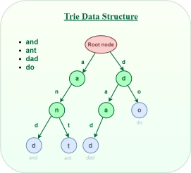
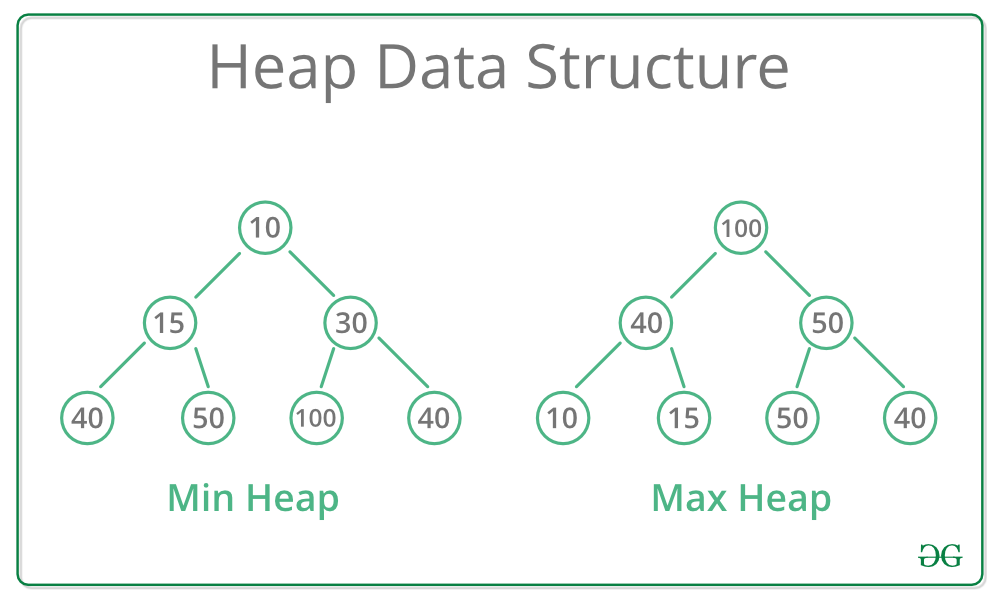

# DSA Theory Notes

## Data Structures

## Linear Data Structures

1. **Arrays**  
   Elements stored in contiguous memory locations, accessed by index  
   When to Use:
    - When you know the size of data beforehand
    - When you need fast random access in O(1)
    - To avoid pointer memory overhead  
      When to avoid:
    - For frequent insertion or deletion (wherever shifting of all elements is required)
2. **Linked Lists**  
   Consists of nodes where each node contains a field and pointer(s)  
   One or two pointers depending on _singly linked_ or _doubly linked_  
   Insertion/Deletion at known position: $O(1)$  
   When to Use:
    - Size of data is dynamic and unpredictable
    - Requires frequent insertion and deletion
    - Don't need random access (go by index)
3. ### Stack
   Last in First Out (LIFO)  
   Time Complexity: Push/Pop/Peek: $O(1)$  
   When to Use:
    - Undo redo functionality
    - Managing function calls (used extensively in Recursion)
    - Syntax Parsing with matching (for e.g. brackets)
4. ### Queue
   First In First Out (FIFO)  
   Time Complexity: Enqueue/Dequeue: $O(1)$  
   When to use:
    - Managing queues for e.g job scheduling
    - Async Data Transfer (MQs)
    - Breadth First Search
5. ### Deque (Double-Ended Queue)
   Allows insertions and deletions at both the front and the back  
   Typically implemented as a sequence of individually allocated fixed-size arrays  
   Time Complexity:
    - Amortized $O(1)$ for insertions and deletions at both ends | $O(1)$ random access.
    - Note: Amortized means on avg since resize which takes $O(n)$ happens only rarely.
    - When to use:
        - Implementing both Stack and Queue behaviors simultaneously.

## Non Linear Data Structures

1. ### Trees:
    1. **Binary Search Tree (BST)**
       Node-based data structure
        - Left subtree of a node contains only nodes with keys lesser value
        - Right subtree of a node contains only nodes with keys greater value
          Insertion is simple: Go from root, if smaller left, greater right until you reach final. (Can result in really
          skewed trees)
            - When? elements inserted in nearly sorted order (e.g., 1, 2, 3, 4, 5)
              Complexity: Avg Insertion $\mathcal{O}(\log n)$, $\mathcal{O}(n)$ when skewed (same as array in that case)
    2. **Balanced Tree**
       Self-balancing variant of a BST which reduces depth, thus making it more performant  
       Automatically maintains its height at a minimum after every insertion and deletion
       Time Complexity (Balanced): Search/Insert/Delete: $O(\log n)$  
       When to Use:
        - You need to maintain data in a sorted order while allowing dynamic insertions and deletions.
        - You need to find elements within a specific range quickly
          Mainly Two Types:
        - **AVL Trees**: Difference between heights of left and right subtrees cannot be more than one for all nodes
        - **Red-Black Tree**: Each node has a color (Red/Black), with each insertion being red by default (root is
          black). Red nodes can't have red children which causes rotation, the idea being every path from root to leaf
          should have equal blacks (can have n reds)
    3. **Trie (Prefix Tree)**  
         
       Tree-like data structure used to store a dynamic set of strings with each node being a character, insertion is
       always $O(L)$ (L=length of string)    
       Useful in text matching like autocomplete
    4. Segment Tree
    5. Fenwick Tree (Binary Indexed Tree)

2. ### Heap
    - A specialized tree-based data structure that satisfies the heap property: in a Min-Heap, the root is always the
      minimum element.
    - 
    - Time Complexity: Get Min/Max: $O(1)$ | Insert/Delete: $O(\log n)$
    - When to use:
        - constant-time access to the highest or lowest priority element.
        - Implementing Priority Queues.
        - Algorithms like Dijkstra’s shortest path or Prim’s minimum spanning tree.
3. ### Hash Table / Hash Map
    - Maps keys to values using a hash function to compute index into an array of buckets.
    - Time Complexity:
        - Search/Insert/Delete: $O(1)$ average case | $O(n)$ worst case (hash collisions)
        - Note: Just because the time complexity is identical to array it's still slower because it can't do random
          memory access
            - Has to calculate hash first then go to value
    - When to use:
        - You need near-instantaneous lookups, insertions, and deletions based on a unique key.
        - Caching, indexing, or dictionary implementations.
4. ### Graph
    - Collection of vertices (nodes) and connections (edges)
    - Can be directed or undirected, weighted unweighted
    - When to use:
        - Modeling networks (social networks, airline routes, computer networks).
        - Pathfinding and routing optimization (e.g., Google Maps).


1. ## Recursion
    - A recursive algorithm takes one step toward solution and then recursively call itself to further move. The
      algorithm
      stops once we reach the solution.
    - Recursive thinking helps in solving complex problems by breaking them into smaller subproblems.
    - Works as a basis for Dynamic Programming and Divide and Conquer algorithms.
    - ℹ️Note: Be sure that there is a termination condition to prevent stack overflow errors
    - The internal systems use a stack because function calling follows LIFO structure, the last called function
      finishes
      first.
    - 🟢 Recursion provides a clean and simple way to write code.
    - 🔴 Recursion can make the code more difficult to understand and debug
    - 🔴 Recursive programs typically have more space requirements and also more time to maintain the recursion call
      stack.
    -
    - Example:
        - The Problem: The Staircase Variations
            - You are standing at the bottom of a staircase with $n$ steps. You can climb either 1 step, 2 steps, or 3
              steps
              at a time. Write a recursive function to calculate the total number of distinct ways you can reach the
              top.
            - Constraints
                - $n \ge 0$
                - If $n = 0$, there is 1 way (staying put).
                - If $n < 0$, there are 0 ways.
        - Solution:
        ```java
        static int staircase(int n){
              if(n == 0){
                  return 1;
              }else if(n <0 ){
                  return 0;
              }else{
                  return staircase(n-3) + staircase(n-2) + staircase(n-1);
              }
          }
        ```
    - Applications:
        - Tree and Graph Traversal: Used for systematically exploring nodes/vertices in data structures like trees and
          graphs.
        - Sorting Algorithms: Algorithms like quicksort and merge sort divide data into subarrays, sort them
          recursively, and merge them.
        - Divide and Conquer Algorithms
2. ## Easy Math
    - Even or Odd: Mod 2 == 1 or 0
    - Sum of first n natural numbers: n(n+1)/2

3. ### Algorithms
    - Djikstra
        - Classic graph search algorithm used to find the shortest path from a single source node to all other nodes in
          a weighted graph
        - Greedy Algorithm, needs all distances to be non -ve
        - Process:
            - Set the distance to the starting node to 0 and to all others infinity
            - For each node assign distance from current node
            - Next visit the closest node (maintaining order in a priority queue) and mark it visited (this is where the
              greedy part comes in)
            - Calculate distance to every other node setting it to be min of dist cur+dist from cur or existing value
            - Similarly, visit all until you reach your goal
        - Why non -ve only?
            - Once a node is marked visited assumes the shortest path to that node is locked in and will never revisit
              it.
            - For e.g if distance to node 1 is 2 and node 2 -> 1 is 1, if node 2 distance is less than 2 only then it
              gets visited first