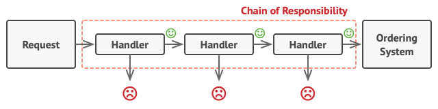
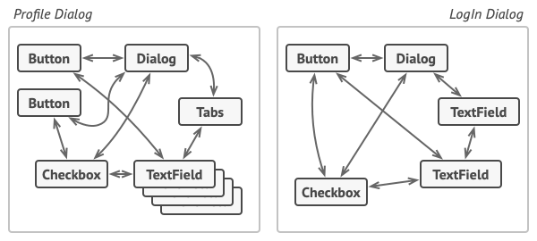
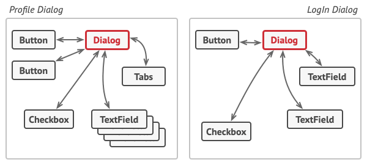

# Design Patterns

- Design patterns are typical solutions to commonly occurring problems in software design
- Types:
    - Creational
    - Structural
    - Behavioural

# Creational Patterns
- Creational design patterns provide various object creation mechanisms, which increase flexibility and reuse of existing code.

1. ### Factory 🟥IMPORTANT🟥
    - Factory Design Pattern is a creational pattern that provides an interface for creating objects in a superclass but
      allows subclasses to alter the type of objects that will be created
    - .i.e You can have multiple implementations of same base class controlled through Factory which creates the product
    - ```java
      interface Shape {
        void draw();
      }
      
      class Circle implements Shape {
        @Override
        public void draw() {
            System.out.println("Drawing a Circle.");
        }
      }
      
      class Square implements Shape {
        @Override
        public void draw() {
            System.out.println("Drawing a Square.");
        }
      }
      
      class ShapeFactory {
        public Shape getShape(String shapeType) {
          if (shapeType == null) {
            return null;
          }
          if (shapeType.equalsIgnoreCase("CIRCLE")) {
            return new Circle();
          } else if (shapeType.equalsIgnoreCase("SQUARE")) {
            return new Square();
          }
          return null;
        }
      }
      ```
2. ### Abstract Factory 🟥IMPORTANT🟥
3. ### Builder <span style="background-color:blue; color:white; padding:1px 4px; border-radius:2px; font-size:0.5em; font-weight:bold;">MODERATE</span>
    - Used to construct complex objects step by step
    - We extract the object construction code out of its own class and move it to separate objects called builders.
    - ```java
      public class Computer {
      // Required parameters
      private String HDD;
      private String RAM;
      
          // Optional parameters
          private boolean isGraphicsCardEnabled;
          private boolean isBluetoothEnabled;
      
          public String getHDD() { return HDD; }
          public String getRAM() { return RAM; }
          public boolean isGraphicsCardEnabled() { return isGraphicsCardEnabled; }
          public boolean isBluetoothEnabled() { return isBluetoothEnabled; }
      
          // Private constructor so only the Builder can instantiate it
          private Computer(ComputerBuilder builder) {
              this.HDD = builder.HDD;
              this.RAM = builder.RAM;
              this.isGraphicsCardEnabled = builder.isGraphicsCardEnabled;
              this.isBluetoothEnabled = builder.isBluetoothEnabled;
          }
      
          // Builder Class
          public static class ComputerBuilder {
              private String HDD;
              private String RAM;
              private boolean isGraphicsCardEnabled;
              private boolean isBluetoothEnabled;
      
              public ComputerBuilder(String hdd, String ram) {
                  this.HDD = hdd;
                  this.RAM = ram;
              }
      
              public ComputerBuilder setGraphicsCardEnabled(boolean isGraphicsCardEnabled) {
                  this.isGraphicsCardEnabled = isGraphicsCardEnabled;
                  return this;
              }
      
              public ComputerBuilder setBluetoothEnabled(boolean isBluetoothEnabled) {
                  this.isBluetoothEnabled = isBluetoothEnabled;
                  return this;
              }
      
              public Computer build() {
                  return new Computer(this);
              }
          }
      }
      
      //Allows us to do this
      Computer comp = new Computer.ComputerBuilder("500 GB", "16 GB")
                .setGraphicsCardEnabled(true)
                .build();
      ```
4. ### Prototype ⬜FRINGE⬜
   - Design pattern that lets you copy existing objects without making your code dependent on their classes.
   - The Prototype pattern lets the actual object being cloned define its own cloning process
   - Abstract Prototype
     - ```java
       abstract class Shape implements Cloneable {
       private String id;
       protected String type;
       
           abstract void draw();
       
           public String getType() { return type; }
           public String getId() { return id; }
           public void setId(String id) { this.id = id; }
       
           @Override
           public Object clone() {
               Object clone = null;
               try {
                   clone = super.clone();
               } catch (CloneNotSupportedException e) {
                   e.printStackTrace();
               }
               return clone;
           }
       }
       ```
   - Concrete:
     - ```java
       class Rectangle extends Shape {
       public Rectangle() { type = "Rectangle"; }
       
           @Override
           public void draw() { System.out.println("Inside Rectangle::draw() method."); }
       }
       ```
5. ### Singleton 🟥IMPORTANT🟥
    - Ensures that each class has a single instance
    - Usually used to control access to a shared resource
    - ```java
      public class DatabaseConnection {
      
          // Private constructor prevents instantiation from other classes
          private DatabaseConnection() {
              System.out.println("Connecting to Database...");
          }
      
          // Static inner class responsible for holding the instance
          private static class Holder {
              private static final DatabaseConnection INSTANCE = new DatabaseConnection();
          }
      
          public static DatabaseConnection getInstance() {
              return Holder.INSTANCE;
          }
      }
      ```
      
# Structural Patterns
1. ### Adapter 🟥IMPORTANT🟥
   - Allows Objects with incompatible interfaces to work together
   - Uses a wrapper class i.e. the adapter that is extends the common interface
   - ```java
     interface MediaPlayer {
         void play(String audioType, String fileName);
     }
     
     //Incompatible Class
     class VlcPlayer {
         void playVlc(String fileName) {
             System.out.println("Playing vlc file: " + fileName);
         }
     }
     
     //Adapter
     class MediaAdapter implements MediaPlayer {
     private VlcPlayer vlcPlayer;
     
         public MediaAdapter() {
             this.vlcPlayer = new VlcPlayer();
         }
     
         @Override
         public void play(String audioType, String fileName) {
             if (audioType.equalsIgnoreCase("vlc")) {
                 vlcPlayer.playVlc(fileName);
             }
         }
     }
     ```
     
2. Bridge ⬜FRINGE⬜
   - First separates out monolith into distinct implementations
   - Uses the abstraction of one in the other (bridges the gap) so both implementations can be maintained seperately
   - ```java
     // Device.java
     public interface Device {
        boolean isEnabled();
        void enable();
        void disable();
        void setVolume(int percent);
        int getVolume();
     }
     
     // Radio.java
     public class Radio implements Device {
     private boolean on = false;
     private int volume = 30;
     
         @Override public boolean isEnabled() { return on; }
         @Override public void enable() { on = true; }
         @Override public void disable() { on = false; }
         @Override public void setVolume(int v) { this.volume = v; }
         @Override public int getVolume() { return volume; }
     }
     
     // Tv.java
     public class Tv implements Device {
     private boolean on = false;
     private int volume = 50;
     
         @Override public boolean isEnabled() { return on; }
         @Override public void enable() { on = true; }
         @Override public void disable() { on = false; }
         @Override public void setVolume(int v) { this.volume = v; }
         @Override public int getVolume() { return volume; }
     }
     
     // RemoteControl.java
     public class RemoteControl {
     protected Device device; // The "Bridge"
     
         public RemoteControl(Device device) {
             this.device = device;
         }
     
         public void togglePower() {
             if (device.isEnabled()) {
                 device.disable();
             } else {
                 device.enable();
             }
         }
     
         public void volumeDown() {
             device.setVolume(device.getVolume() - 10);
         }
     
         public void volumeUp() {
             device.setVolume(device.getVolume() + 10);
         }
     }
     ```
3. Composite 🟦MODERATE🟦
   - Only for tree like structures
   - Mainly for uniformity
   - Both individual objects (Leaf) and containers (Composite) to implement the same interface
   - The client code treats a single object and a complex tree exactly the same way.
   - ```java
     interface Node { void print(); }
     
     class Leaf implements Node {
     private String name;
        Leaf(String name) { this.name = name; }
        public void print() { System.out.println(name); }
     }
     
     class Composite implements Node {
        private List<Node> children = new ArrayList<>();
        void add(Node n) { children.add(n); }
        public void print() { children.forEach(Node::print); }
     }
     
     public class Main {
     public static void main(String[] args) {
     Composite root = new Composite();
     root.add(new Leaf("Leaf A"));
     
             Composite sub = new Composite();
             sub.add(new Leaf("Leaf B"));
             
             root.add(sub);
             root.print(); // Uniformly executes across the tree
         }
     }
     ```
4. Decorator/Wrapper 🟦MODERATE🟦
   - Decorator wraps the existing base instance with a wrapper with more features(variables/methods)
   - ```java 
     interface Coffee { double cost(); }
     
     class SimpleCoffee implements Coffee {
        public double cost() { return 2.0; }
     }
     //decorator
     abstract class CoffeeDecorator implements Coffee {
        protected Coffee coffee;
        public CoffeeDecorator(Coffee c) { this.coffee = c; }
        public double cost() { return coffee.cost(); }
     }
     
     class Milk extends CoffeeDecorator {
        public Milk(Coffee c) { super(c); }
        public double cost() { return super.cost() + 0.5; }
     }
     ```
5. Facade 🟦MODERATE🟦
   - Provides a simplified interface to a library, a framework, or any other complex set of classes
   - Only the facade is aware of the complex inner working and calls them
   - Subsystems operate independently and Client calls only the facade
   - ```java
     //Subsystems
     class Audio { void on() { System.out.println("Audio on"); } }
     class Video { void on() { System.out.println("Video on"); } }
     
     //Facade
     class CinemaFacade {
     private Audio audio = new Audio();
     private Video video = new Video();
     
         public void play() {
             audio.on();
             video.on();
         }
     }
     
     //Client
     public class Main {
       public static void main(String[] args) {
        new CinemaFacade().play(); // Simplified call
       }
     }
     ```
6. Flyweight ⬜FRINGE⬜
7. Proxy
   - Provides a substitute or placeholder for another object. 
   - A proxy controls access to the original object
   - Allows you to perform code before or after it, for example logging, controlling acces
   - Uses the same signature as the object it wraps
   - ```java
     interface Subject {
        void request();
     }
     
     class RealSubject implements Subject {
        public void request() {
        System.out.println("RealSubject: Handling request.");
        }
     }
     
     class Proxy implements Subject {
        private RealSubject realSubject;
     
         public void request() {
             if (realSubject == null) {
                 realSubject = new RealSubject(); // Lazy initialization
             }
             System.out.print("Proxy: Logging access before ");
             realSubject.request();
         }
     }
     ```

# Behavioral
1. Chain of Responsibility 🟥Important🟥
   -  lets you pass requests along a chain of handlers.
   - Used in spring filters
   - relies on transforming particular behaviors into stand-alone objects called handlers.
   - 
2. Command 🟥Important🟥
    - Turns a request into a stand-alone object that contains all information about the request.
    - Lets you pass requests as method arguments, delay or queue a request's execution, and support undoable operations.
    - ```java
      // 1. Command Interface
      interface Command {
      void execute();
      }
      
      // 2. Receiver
      class Light {
      void turnOn() { System.out.println("Light is ON"); }
      }
      
      // 3. Concrete Command
      class LightOnCommand implements Command {
      private Light light;
      public LightOnCommand(Light light) { this.light = light; }
      public void execute() { light.turnOn(); }
      }
      
      // 4. Invoker
      class RemoteControl {
      private Command slot;
      public void setCommand(Command command) { slot = command; }
      public void pressButton() { slot.execute(); }
      }
      
      // Client
      public class Main {
      public static void main(String[] args) {
      Light light = new Light();
      Command lightOn = new LightOnCommand(light);
      
              RemoteControl remote = new RemoteControl();
              remote.setCommand(lightOn);
              remote.pressButton();
          }
      }
      ```
      - Note:
        - While it makes the component (RemoteControl) lightweight which can execute anything passed in as a command
        - It increases the number of classes by a lot, one for each command
3. Iterator 🟥Important🟥
   - lets you traverse elements of a collection without exposing its underlying representation
4. Mediator 🟦Moderate🟦
   - Remove interdependencies between components by removing chaotic direct calls to each others code
   - All calls must go through a common mediator
   - Before:
     - 
   - After:
     - 
5. Memento ⬜Fringe⬜
6. Observer 🟥Important🟥
   - Base of pub sub model
   - When one object (the Subject) changes state, all its dependents (Observers) are notified and updated automatically.
   - Two models:
     - Push Model:
       - Publisher forces subscriber to get the data and consume it
     - Pull Model:
       - Publisher notifies the subscriber who then can pull when it wants
     - Either way both driven by publisher
     - Note: This is only half same as MQ which work on Polling. This has temporal coupling which requires both pub sub to be online at same time
7. State 🟥Important🟥
   - Allows a program to change its behavior when its internal state changes.
   - Essentially instead of creating if else to identify which state to be in, we swap to the state itself and run that linearly
   - ```java
     // State Interface
     interface State {
        void handle(LightSwitch context);
     }
     
     // Concrete States
     class OnState implements State {
        public void handle(LightSwitch context) {
            System.out.println("Turning light OFF.");
            context.setState(new OffState());
        }  
     }
     
     class OffState implements State {
        public void handle(LightSwitch context) {
            System.out.println("Turning light ON.");
            context.setState(new OnState());
        }
     }
     
     // Context
     class LightSwitch {
        private State state = new OffState(); // Initial state
     
         public void setState(State state) { this.state = state; }
         public void press() { state.handle(this); }
     
         public static void main(String[] args) {
             LightSwitch light = new LightSwitch();
             light.press(); // Turning light ON.
             light.press(); // Turning light OFF.
         }
     }
     ```           
     - Since the states are swapped in and out they can only hold data related to themselves and context must be passed in
     - The logic to swap in must also be implemented, ideally at the end of last state
     - The state transition logic typically resides in one of two places:
       - Inside the Concrete States (Self-Transition)
       - Inside the Context (.i.e you pass in where you should transition next)
8. Strategy 🟥Important🟥
   - Defines a family of algorithms, encapsulates each one, and makes them interchangeable.
   - It allows the algorithm to vary independently of the clients that use it.
   - Very similar to state except we are not transitioning between states, they are independent
   - ```java 
     interface PaymentStrategy {
        void pay(int amount);
     }
     
     class CreditCardPayment implements PaymentStrategy {
       public void pay(int amount) {
         System.out.println("Paid " + amount + " using Credit Card.");
       }
     }
     
     class PaypalPayment implements PaymentStrategy {
        public void pay(int amount) {
            System.out.println("Paid " + amount + " using PayPal.");
        }
     }
     class ShoppingCart {
     private PaymentStrategy strategy;
     
         // The strategy is injected, usually via constructor or setter
         public void setPaymentStrategy(PaymentStrategy strategy) {
             this.strategy = strategy;
         }
     
         public void checkout(int amount) {
             strategy.pay(amount);
         }
     }
     public class Main {
        public static void main(String[] args) {
            ShoppingCart cart = new ShoppingCart();
     
             // User selects Credit Card
             cart.setPaymentStrategy(new CreditCardPayment());
             cart.checkout(100);
     
             // User switches to PayPal
             cart.setPaymentStrategy(new PaypalPayment());
             cart.checkout(200);
         }
     }
     ```
9. Template Method 🟥Important🟥
    - defines the skeleton of an algorithm in a base class
    - Allows subclasses to redefine certain steps of that algorithm without changing its overall structure
    - ```java
      abstract class DataMiner {
      // This is the Template Method
      public final void mineData() {
      openFile();
      extractData(); // Step to be implemented by subclass
      parseData();   // Step to be implemented by subclass
      closeFile();
      }
      
          private void openFile() { 
              System.out.println("Opening file..."); 
          }
      
          private void closeFile() { 
              System.out.println("Closing file..."); 
          }
      
          // Subclasses must provide these
          protected abstract void extractData();
          protected abstract void parseData();
      }
      ```
    - You define what you want to be replaceable as a method
    - Limitation is that it creates a rigid contract between the base class and the subclasses.
10. Visitor ⬜Fringe⬜