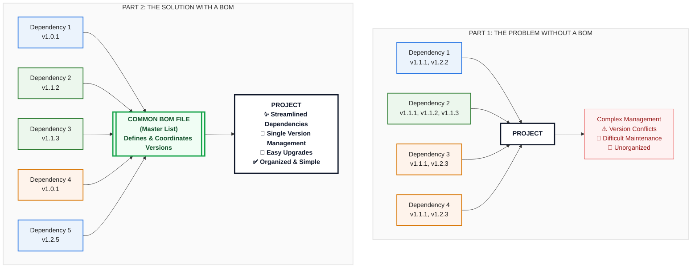
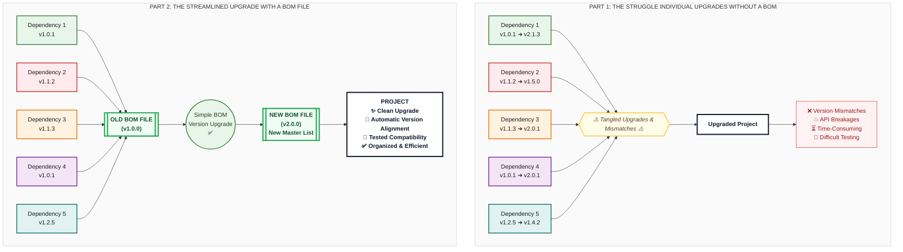

```mermaid
flowchart TB
    subgraph Part1 [PART 1: THE PROBLEM WITHOUT A BOM]
        direction LR
        p1_d1[Dependency 1<br/>v1.1.1, v1.2.2]:::blueD --> p1_proj
        p1_d2[Dependency 2<br/>v1.1.1, v1.1.2, v1.1.3]:::greenD --> p1_proj
        p1_d3[Dependency 3<br/>v1.1.1, v1.2.3]:::orangeD --> p1_proj
        p1_d4[Dependency 4<br/>v1.1.1, v1.2.3]:::orangeD --> p1_proj
        
        p1_proj[PROJECT]:::projectBox --> p1_issues[Complex Management<br/>⚠️ Version Conflicts<br/>🔧 Difficult Maintenance<br/>🚫 Unorganized]:::issueBox
    end

    subgraph Part2 [PART 2: THE SOLUTION WITH A BOM]
        direction LR
        p2_d1[Dependency 1<br/>v1.0.1]:::blueD --> BOM
        p2_d2[Dependency 2<br/>v1.1.2]:::greenD --> BOM
        p2_d3[Dependency 3<br/>v1.1.3]:::greenD --> BOM
        p2_d4[Dependency 4<br/>v1.0.1]:::orangeD --> BOM
        p2_d5[Dependency 5<br/>v1.2.5]:::blueD --> BOM

        BOM[["COMMON BOM FILE<br/>(Master List)<br/>Defines & Coordinates Versions"]]:::bomBox --> p2_proj
        
        p2_proj[PROJECT<br/>✨ Streamlined Dependencies<br/>🎯 Single Version Management<br/>🚀 Easy Upgrades<br/>✅ Organized & Simple]:::projectBox
    end

    %% Styling
    classDef blueD fill:#EBF3FC,stroke:#2B78E4,stroke-width:2px,color:#1A1A1A;
    classDef greenD fill:#ECF7ED,stroke:#2E7D32,stroke-width:2px,color:#1A1A1A;
    classDef orangeD fill:#FEF3EB,stroke:#D97706,stroke-width:2px,color:#1A1A1A;
    classDef projectBox fill:#FFFFFF,stroke:#0F172A,stroke-width:3px,font-weight:bold,color:#0F172A;
    classDef issueBox fill:#FEF2F2,stroke:#DC2626,stroke-width:1px,color:#991B1B;
    classDef bomBox fill:#F0FDF4,stroke:#16A34A,stroke-width:3px,font-weight:bold,color:#14532D;
    
    style Part1 fill:#FAFAFA,stroke:#E5E5E5,stroke-width:2px;
    style Part2 fill:#FAFAFA,stroke:#E5E5E5,stroke-width:2px;
```

```mermaid
flowchart TB
    subgraph Part1 [PART 1: THE STRUGGLE INDIVIDUAL UPGRADES WITHOUT A BOM]
        direction LR
        p1_d1[Dependency 1<br/>v1.0.1 ➔ v2.1.3]:::greenD -. "⚠️" .-> p1_proj
        p1_d2[Dependency 2<br/>v1.1.2 ➔ v1.5.0]:::redD -. "❓" .-> p1_proj
        p1_d3[Dependency 3<br/>v1.1.3 ➔ v2.0.1]:::orangeD -. "⚠️" .-> p1_proj
        p1_d4[Dependency 4<br/>v1.0.1 ➔ v2.0.1]:::purpleD -. "❓" .-> p1_proj
        p1_d5[Dependency 5<br/>v1.2.5 ➔ v1.4.2]:::tealD -. "⚠️" .-> p1_proj
        
        p1_proj[Upgraded Project]:::projectBox --> p1_issues[Version Mismatches<br/>⚡ API Breakages<br/>⏳ Time-Consuming<br/>🚫 Difficult Testing]:::issueBox
    end

    subgraph Part2 [PART 2: THE STREAMLINED UPGRADE WITH A BOM FILE]
        direction LR
        subgraph Deps [Current Dependencies]
            direction TB
            p2_d1[Dependency 1<br/>v1.0.1]:::greenD
            p2_d2[Dependency 2<br/>v1.1.2]:::redD
            p2_d3[Dependency 3<br/>v1.1.3]:::orangeD
            p2_d4[Dependency 4<br/>v1.0.1]:::purpleD
            p2_d5[Dependency 5<br/>v1.2.5]:::tealD
        end

        Deps --> old_bom
        
        old_bom[["OLD BOM FILE<br/>(v1.0.0)"]]:::bomBox --> |"🔄 Simple BOM<br/>Version Upgrade"| new_bom[["NEW BOM FILE<br/>(v2.0.0)<br/>New Master List"]]:::bomBox
        
        new_bom --> p2_proj[PROJECT<br/>✨ Clean Upgrade<br/>🎯 Automatic Version Alignment<br/>🛡️ Tested Compatibility<br/>✅ Organized & Efficient]:::projectBox
    end

    %% Styling Definitions
    classDef greenD fill:#E6F4EA,stroke:#10B981,stroke-width:2px,color:#137333;
    classDef redD fill:#FCE8E6,stroke:#F44336,stroke-width:2px,color:#C5221F;
    classDef orangeD fill:#FEF3C7,stroke:#F59E0B,stroke-width:2px,color:#B45309;
    classDef purpleD fill:#F3E8FF,stroke:#8B5CF6,stroke-width:2px,color:#6D28D9;
    classDef tealD fill:#E0F7FA,stroke:#00ACC1,stroke-width:2px,color:#006064;
    
    classDef projectBox fill:#FFFFFF,stroke:#0F172A,stroke-width:3px,font-weight:bold,color:#0F172A;
    classDef issueBox fill:#FEF2F2,stroke:#DC2626,stroke-width:1px,color:#991B1B;
    classDef bomBox fill:#F0FDF4,stroke:#16A34A,stroke-width:3px,font-weight:bold,color:#14532D;
    
    style Part1 fill:#FAFAFA,stroke:#E5E5E5,stroke-width:2px;
    style Part2 fill:#FAFAFA,stroke:#E5E5E5,stroke-width:2px;
```

```mermaid
flowchart TB
    subgraph Part1 [PART 1: THE STRUGGLE INDIVIDUAL UPGRADES WITHOUT A BOM]
        direction LR
        p1_d1["Dependency 1<br/>v1.0.1 ➔ v2.1.3"]:::greenD
        p1_d2["Dependency 2<br/>v1.1.2 ➔ v1.5.0"]:::redD
        p1_d3["Dependency 3<br/>v1.1.3 ➔ v2.0.1"]:::orangeD
        p1_d4["Dependency 4<br/>v1.0.1 ➔ v2.0.1"]:::purpleD
        p1_d5["Dependency 5<br/>v1.2.5 ➔ v1.4.2"]:::tealD

        p1_d1 --> p1_chaos
        p1_d2 --> p1_chaos
        p1_d3 --> p1_chaos
        p1_d4 --> p1_chaos
        p1_d5 --> p1_chaos

        p1_chaos{{"⚠️ Tangled Upgrades & Mismatches ⚠️"}}:::chaosBox
        
        p1_chaos --> p1_proj
        
        p1_proj["Upgraded Project"]:::projectBox --> p1_issues["❌ Version Mismatches<br/>💥 API Breakages<br/>⏳ Time-Consuming<br/>🚫 Difficult Testing"]:::issueBox
    end

    subgraph Part2 [PART 2: THE STREAMLINED UPGRADE WITH A BOM FILE]
        direction LR
        p2_d1["Dependency 1<br/>v1.0.1"]:::greenD
        p2_d2["Dependency 2<br/>v1.1.2"]:::redD
        p2_d3["Dependency 3<br/>v1.1.3"]:::orangeD
        p2_d4["Dependency 4<br/>v1.0.1"]:::purpleD
        p2_d5["Dependency 5<br/>v1.2.5"]:::tealD

        p2_d1 --> BOM_old
        p2_d2 --> BOM_old
        p2_d3 --> BOM_old
        p2_d4 --> BOM_old
        p2_d5 --> BOM_old

        BOM_old[["OLD BOM FILE<br/>(v1.0.0)"]]:::bomBox
        p2_upg(("Simple BOM<br/>Version Upgrade<br/>✅")):::upgBox
        BOM_new[["NEW BOM FILE<br/>(v2.0.0)<br/>New Master List"]]:::bomBox
        
        BOM_old --> p2_upg --> BOM_new --> p2_proj
        
        p2_proj["PROJECT<br/>✨ Clean Upgrade<br/>🎯 Automatic Version Alignment<br/>🚀 Tested Compatibility<br/>✅ Organized & Efficient"]:::projectBox
    end

    %% Styling
    classDef greenD fill:#E8F5E9,stroke:#2E7D32,stroke-width:2px,color:#1A1A1A;
    classDef redD fill:#FFEBEE,stroke:#C62828,stroke-width:2px,color:#1A1A1A;
    classDef orangeD fill:#FFF3E0,stroke:#EF6C00,stroke-width:2px,color:#1A1A1A;
    classDef purpleD fill:#F3E5F5,stroke:#6A1B9A,stroke-width:2px,color:#1A1A1A;
    classDef tealD fill:#E0F2F1,stroke:#00695C,stroke-width:2px,color:#1A1A1A;
    
    classDef projectBox fill:#FFFFFF,stroke:#0F172A,stroke-width:3px,font-weight:bold,color:#0F172A;
    classDef issueBox fill:#FEF2F2,stroke:#DC2626,stroke-width:1px,color:#991B1B;
    classDef bomBox fill:#F0FDF4,stroke:#16A34A,stroke-width:3px,font-weight:bold,color:#14532D;
    classDef chaosBox fill:#FFFDE7,stroke:#FBC02D,stroke-width:2px,color:#5D4037,font-style:italic;
    classDef upgBox fill:#E8F5E9,stroke:#2E7D32,stroke-width:2px,color:#1E4620;
    
    style Part1 fill:#FAFAFA,stroke:#E5E5E5,stroke-width:2px;
    style Part2 fill:#FAFAFA,stroke:#E5E5E5,stroke-width:2px;
```